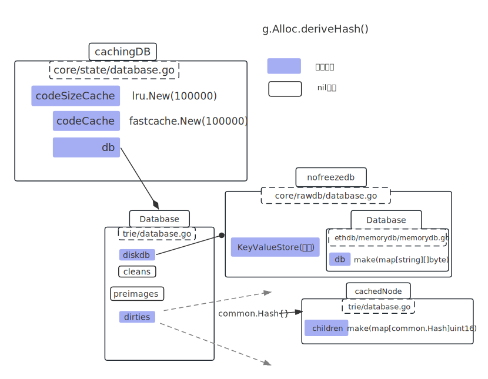
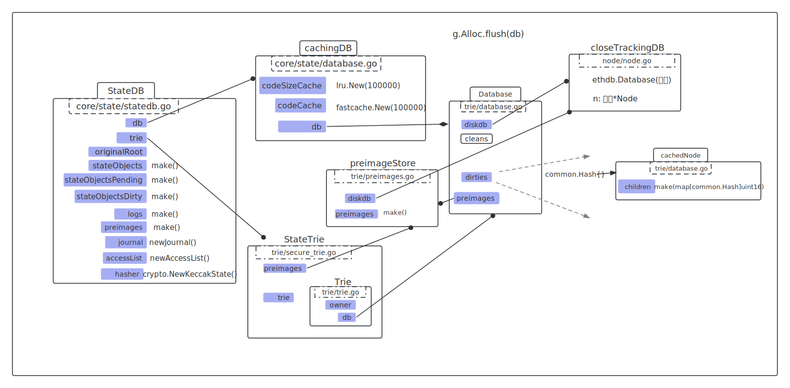
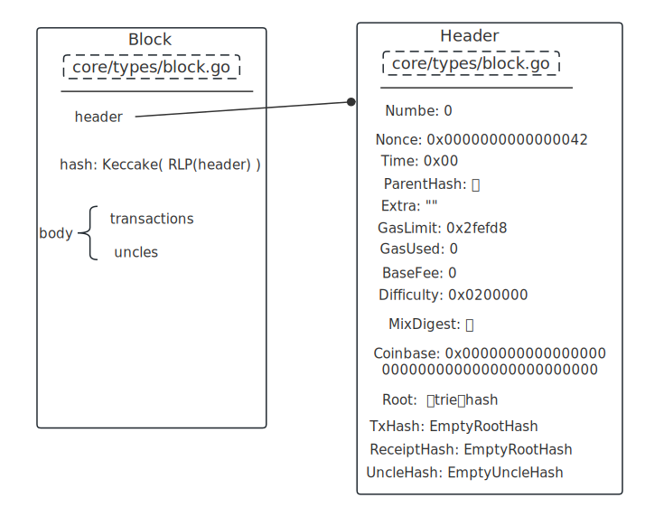

# Genesis

genesis.json：

```json
{
  "config": {
        "chainId": 10,
        "homesteadBlock": 0,
				"eip150Block": 0,
        "eip155Block": 0,
        "eip158Block": 0
  },
  "alloc"      : {},
  "coinbase"   : "0x0000000000000000000000000000000000000000",
  "difficulty" : "0x0200000",
  "extraData"  : "",
  "gasLimit"   : "0x2fefd8",
  "nonce"      : "0x0000000000000042",
  "mixhash"    : "0x0000000000000000000000000000000000000000000000000000000000000000",
  "parentHash" : "0x0000000000000000000000000000000000000000000000000000000000000000",
  "timestamp"  : "0x00"
}
```

<br />

Genesis struct：

```go
type Genesis struct {
  Config *params.ChainConfig: {
    ChainID  *big.Int: 10,
    HomesteadBlock *big.Int: 0,
    EIP150Block *big.Int: 0,
    EIP155Block *big.Int: 0,
    EIP158Block *big.Int: 0,
  },
  
  Nonce      uint64: 0x0000000000000042,
  Timestamp  uint64: 0x00,
  ExtraData  []byte: "",
  GasLimit   uint64: 0x2fefd8,
  Difficulty *big.Int: 0x0200000,
  Mixhash  common.Hash: 0x0000000000000000000000000000000000000000000000000000000000000000,
  Coinbase common.Address: 0x0000000000000000000000000000000000000000,
  Alloc    GenesisAlloc: {}

	// These fields are used for consensus tests. Please don't use them
	// in actual genesis blocks.
	Number uint64
	GasUsed uint64
	ParentHash common.Hash
	BaseFee *big.Int
}
```

<br />

Genesis.Alloc.deriveHash()方法：

```go
diskdb = &nofreezedb{ // core/rawdb/
  					KeyValueStore: &Database{ // ethdb/memorydb
										db: make(map[string][]byte),
						},
					}

最终的db:
&cachingDB{ // core/state/
  db: &Database{ // trie/
    		diskdb: 
    		cleans: nil,
        dirties:  {
          					{} -> *cachedNode{ children: map() },
        					},
        preimages: nil,
  		},
  
  codeSizeCache: lur.New(100000),
  codeCache: fastcache.New(100000),
}

db.OpenTrie()返回：
&StateTrie{ // trie/
  //空的trie树
  trie: &Trie{
		owner: common.Hash{},
		db: 指向的cachingDB.db,
	}, 
  
  preimages: db.preimages, // nil
}

statedb:
sdb := &StateDB{ // core/state/
		db: 指向cachingDB
		trie: 指向stateTrie
		originalRoot: common.Hash{},
		snaps: nil,
		stateObjects:        make(map[common.Address]*stateObject),
		stateObjectsPending: make(map[common.Address]struct{}),
		stateObjectsDirty:   make(map[common.Address]struct{}),
		logs:                make(map[common.Hash][]*types.Log),
		preimages:           make(map[common.Hash][]byte),
		journal: &journal{
			dirties: make(map[common.Address]int),
		},
		accessList: &accessList{
			addresses: make(map[common.Address]int),
		},
		hasher: crypto.NewKeccakState(), // 一个hash函数
}

```



<br />

g.Alloc.flush(db)



<br />

g.ToBlock() && block.hash()：




rawdb.WriteTd(db, block.Hash(), block.NumberU64(), block.Difficulty())：

blockHash =  keccake( RLP(header) )；

写入：h + num + blockHash + t  -----> diffuculty

例："h0slfjlkjfo23t" ----> 0x0200000

<br />

  rawdb.WriteBlock(db, block)：

写入body：   b + num + blockHash   ------>  RLP( transactions + uncles )；

写入header：H +  blockHash  ----> number

​						 h + num + blockHash  ---->  RLP( header )

<br />

  rawdb.WriteReceipts(db, block.Hash(), block.NumberU64(), nil)：

写入：r + num + blockHash  ------>  RLP ( receipts ) 空的

<br />

  rawdb.WriteCanonicalHash(db, block.Hash(), block.NumberU64())：

写入：h + num + n   ----->  blockHash

<br />

  rawdb.WriteHeadBlockHash(db, block.Hash())：

写入：LastBlock  ----->  blockHash

<br />

  rawdb.WriteHeadFastBlockHash(db, block.Hash())：

写入：LastFast  ------>  blockHash

<br />

  rawdb.WriteHeadHeaderHash(db, block.Hash())：

写入：LastHeader  ------> blockHash

<br />

  rawdb.WriteChainConfig(db, block.Hash(), config)：

写入：ethereum-config- + blockHash  ------->   "config": {

 "chainId": 10,
 "homesteadBlock": 0,
 "eip150Block": 0,
  "eip155Block": 0,
  "eip158Block": 0
  }

<br />


