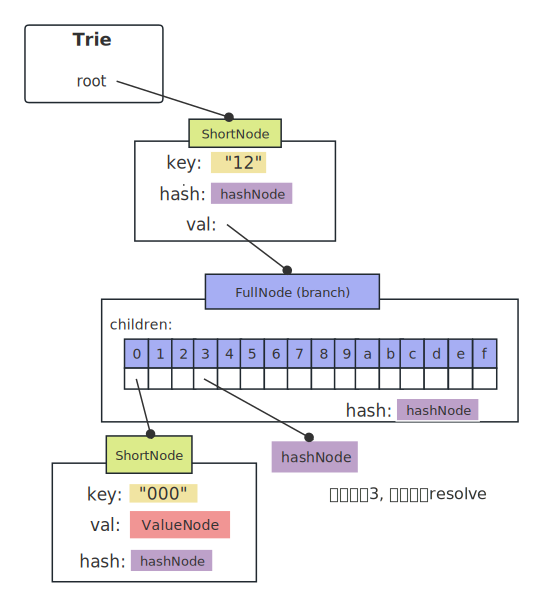

- [前置](#前置)
	- [数组比较==](#数组比较)
	- [空指针方法](#空指针方法)
	- [nil append](#nil-append)
	- [空串map key](#空串map-key)
	- [nibble：半字节](#nibble半字节)
- [Trie树](#trie树)
	- [结构](#结构)
- [从trie\_test.go看起](#从trie_testgo看起)
	- [TestNull](#testnull)
	- [TestMissingRoot](#testmissingroot)
	- [TestSubKey 与db无关](#testsubkey-与db无关)
	- [TestMissingNodeDisk](#testmissingnodedisk)


<br />


# 前置

## 数组比较==

go的数组比较：只能是长度相同，且元素坑位的值相同，才返回true。

```go
type Hash [32]byte

root := Hash{}
root == Hash{} // true
```

<br />

## 空指针方法

go可以调用空指针的方法!

```go
type Trie struct {
	root  node
	owner common.Hash // 相当于一个32位长度的byte数组
	db *Database
	tracer *tracer
}

trie := &Trie{
		owner: owner,
		db:    db,
}

// tracer是nil指针, 但可以调用
t.tracer.onInsert(prefix)

// 只不过, 要判断
func (t *tracer) onInsert(key []byte) {
	if t == nil {
		return
	}
```

<br />

## nil append

可以对nil切片append

```go
package main
import "fmt"

func hold(path []byte) {
	fmt.Println(string(path))
}

func commit(path []byte) {
  // 打印hello, 不影响path
	hold(append(path, []byte("hello")...))
  
  // 打印[]
	fmt.Println(path)
  
  // 打印空串
	fmt.Println(string(path))
}

func main() {
	commit(nil)
}
```

<br />

## 空串map key

空串可做map的key

<br />

## nibble：半字节

把一个字节的高4位，低4位分开

18~2~ = 0001 0010

Str: [ 18 ] => nibbles: [ 0x01, 0x02, 16 ]

```go
func keybytesToHex(str []byte) []byte {
	l := len(str)*2 + 1
	var nibbles = make([]byte, l)
	for i, b := range str {
		nibbles[i*2] = b / 16
		nibbles[i*2+1] = b % 16
	}
	nibbles[l-1] = 16
	return nibbles
}
```

<br />

# Trie树

前缀树 + merkle树 的结合体

## 结构

```go
type Trie struct {
	root  node // 根 interface
	owner common.Hash // [32]byte 别名
	db *Database
	tracer *tracer
}

// 代表一空树的字段
trie := &Trie{
  root: nil,
  owner: common.Hash{},
  db: db,
  tracer: nil,
}
```

<br />


# 从trie_test.go看起

## TestNull

```go
/*
	空的key, 形成的半字节, 也就是在ShortNode中存储的Key内容:
	[ 0x00, 0x00, ....,    16 ]
	  ---- 64个 ------  后面固定是16
*/
key := make([]byte, 32)
value := []byte("test")

// trie树的val与上层的value是相同指向, 注意不要在上层改变value的值
trie.Update(key, value)
```


```go
// ValueNode是别名
type valueNode []byte
```

<br />

## TestMissingRoot

trie.db稍微露脸了，测试目地：db里找不到对应root hash的trie node时，构建Trie树失败，应返回错误。

```go
trie, err := New(
  common.Hash{}, // owner
  common.HexToHash("0beec7b5ea3f0fdbc95d0dd47f3c5bc275da8a33"), // root
  NewDatabase(memorydb.New())
)

```

有几个概念要区分一下：

type Hash [32]byte：Hash就是32字节的数组。

type hashNode  []byte：代表Trie树里的Node，即注释里的trie node，长度不定, 但一般与Hash长度一致。

```go
// 从 cache(t.db.cleans、t.db.dirties)、磁盘(t.db.diskdb)里找对应hash的node
func (t *Trie) resolveHash(n hashNode, prefix []byte) (node, error) {
  hash := common.BytesToHash(n) // hashNode: []byte 切片转[32]数组
  if node := t.db.node(hash); node != nil {
		return node, nil
	}
}
```

<br />

## TestSubKey 与db无关

```go
updateString(trie, "120000", "qwerqwerqwerqwerqwerqwerqwerqwer")
updateString(trie, "12000045", "asdfasdfasdfasdfasdfasdfasdfasdf")
```


Nibble("120000")       = 120000 16(最后面有个16)

Nibble("12000045”） = 120000  4  5  16

​                                                          i(matchlen在这)

<br />

## TestMissingNodeDisk

```go
updateString(trie, "120000", "qwerqwerqwerqwerqwerqwerqwerqwer")
updateString(trie, "123456", "asdfasdfasdfasdfasdfasdfasdfasdf")
```


<br />

**t.Hash()**：从底向上，层级hash，实现了merkle功能

```go
func (t *Trie) Hash() common.Hash {
	hash, cached, _ := t.hashRoot() // 返回的是 node接口
	t.root = cached
	return common.BytesToHash(hash.(hashNode))
}
```


要点：

1. hash(node) =  keccak( RPL( List[ key, value ] ) )；
2. 如果Len( RPL( List[ key, value ] )  ) < 32，说明数据不大，直接存也没问题，直接返回该ShortNode，否则hash一下，返回一个hashNode；
3. root必须hash，所以force = true，最终返回的是root hash；
4. trie.Hash()只是填充node.flag.hash值，node.flag.dirty 依然 = true；

<br />

**h.Commit(t.root)**：找到所有的dirty nodes，并返回nodeSet和root hash：

```go
h := newCommitter(t.owner, collectLeaf)
/** committer结构

h: &committer{
	collectLeaf: false,
	
	// NodeSet存的是所有的dirty nodes
	nodes:  &NodeSet{ 
		owner: t.owner,
		paths []string,
		nodes: make(map[string]*memoryNode),
		leaves []*leaf
	},
}

*/
newRoot, nodes, err := h.Commit(t.root)
```


此时, trie的root指向了一个纯hashNode了：


<br />

  **triedb.Update(NewWithNodeSet(nodes)**)：往db.dirties里填充 { node hash值 -> cachedNode {} }


要点：

1. 各个cachedNode相互连接；
2. hash4是root hash，对应的cachedNode.node.val是hash3，依次类推；

<br />

 **triedb.Commit(root, true, nil)**：按图索骥，从triedb.dirties里按层级取，放在batch里，之后一次性写入底层db。最后清空triedb.dirties。

```powershell
传入root: common.Hash类型, root hash值。

commit(hash4) 先 commit(hash3) 先 comimt(hash1)、commit(hash2)。

放在batch里：
[ 
  { key: hash1, value: cachedNode1.node.rpl() },
  { key: hash2, value: cachedNode2.node.rpl() },
  { key: hash3, value: cachedNode3.node.rpl() },
  { key: hash4, value: cachedNode4.node.rpl() },
]
写kv，先写底层node，再写上层node，按顺序写入底层db存储。memorydb就是一个Map。

```

此时，triedb又回到了原来的空状态。

triedb底层已经有了数据，状态如下：


如果是LevelDB，key有序排列着。

<br />

  **trie, _ = New(common.Hash{}, root, triedb)**：找到从triedb的底层db找到root node，并解码。


要点：

1. 底层db存的key是原始key，转成trie node要转换为nibble key；
2. node.val是下层FullNode的hash 值；
3. node.hash是当前node hash值；
4. 以root hash构造的trie树，目前只有一个root node；

<br />

  **_, err := trie.TryGet([]byte("120000"))**：

1. 从root node开始查找，对比key，发现需要往下层找；
2. root node.val是hashNode，随即去trie.db底层找该hash值对应的 trie node，这一步叫resolveHash；
3. 比较重要且细节的地方：resolveHash时，会替换经过的trie node.val，还原成一棵有数据的树，这也是参数didResolve的作用；

经过 "12"、"0"、"000"，替换val后的trie：



因为children[3]还没经过，所以还是保存的"456"的hash。

<br />

  **_, err = trie.TryGet([]byte("120099"))：**

有个小细节，关于TryGet返回的 err。这里查找"120099"，明显trie树里没有，但返回的err是nil。

原因是：

"120099" 经过的所有结点都已经resolve了，不需要再去底层db去找，查找只需在这棵树上，所以返回nil；

如果是 "12345"，此时children[3]还没resolve，拿着children[3]的hash值去底层db找，如果没找到，那就会返回MissingNodeError；

这点trie.TryGet()方法注释也提了一嘴。

<br />

  **_, err = trie.TryGet([]byte("123456"))：**这下会resolve children[3]，彻底还原出原来的trie树。

<br />

  **err = trie.TryUpdate([]byte("120099"), []byte("zxcvzxcvzxcvzxcvzxcvzxcvzxcvzxcv"))**：

再一次分裂：


注意，底层改变了，上层也跟着变，都变dirty了，hash也是空了。

<br />

再看最后一个， **err = trie.TryDelete([]byte("123456"))**：


删除也会引发trie树，由下而上的改动：node变dirty，hash变空。

<br />