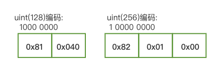

# 03 RLP编码


# uint

uint8、uint16、uint32、uint64都按照uint64来处理。对于uint(x)的值：

1. x == 0，直接写入 0x80;

2. x < 128，写入自身 x;

   ```js
   这里为什么是 < 128? 128 = 2^7, 二进制是
   0 000 0000
   1 000 0000
   
   因为是要用多字节存储，所以需要一个办法知道，后面还有没有连续的字节，所以牺牲了部分数据范围，用最高位来表示后续是否还有字节。
   ```

   

3. 否则，写入 0x80 + 字节长度  高位  低位;

   



[简单的验证步骤。](./X_03_rlp_验证.md#kk)


big.Int

位数 > 64位，不支持负大数。x为bit.Int， 二进制位数为bitlen，bitlen的字节长度为length。

1. length < 56，写入0x80 + length；
2. 否则，写入0xB7 + length的字节长度  length值高位  length值低位；
3. 写入x的高位字节  x的低字节；


例1：x = 0x102030405060708090A0B0C0D0E0F2

二进制位数bitlen = 120，字节长度length = 15，

最终写入 0x80+15  10  20  30  ....  F2


例2：x = 0x102030405060708090A0B0C0D0E0F2

​				102030405060708090A0B0C0D0E0F2

​				102030405060708090A0B0C0D0E0F2

​				102030405060708090A0B0C0D0E0F2

方便查看, 中间用空格隔开。

二进制位数bitlen = 480，字节长度length = 60，

最终写入 0xB7+1(存60只要一个字节)   0x3C(60)  10  20  30  ....  F2   10  20  30 ...  F2


List

首先对一个扁平的list编码：

list = [ X~1~, X~2~, X~3~, ....   X~n~ ]，假设X~i~ 是unit64，list的长度是n，

1. n < 56，写入0xC0 + n 、X~1~、 X~2~  ...  X~n~ ；
2. n >= 56，写入 0xF7 + n的字节长度 、n的高位、n的低位、X~1~、X~2~、... X~n~；

举例：list = [ 1, 2, 3, 4, 5, 6 ]，编码就是：0xC0+6、1、2、3、4、5、6。

list = [ 1, 2, 3, 4, ... , 257 ]，257二进制表示为：1 00000001 需要两个字节存下257，那么257的字节长度就是2，编码就是：0xF7+2、0x01(257的高位)、0x01(257的低位)、1、2、3、... 257。


可以看到，一个list固定需标志（0xC0、0xF7这些），然后是长度，对于长度<56的，长度内嵌到标志里，而对于长度>=56的，需要额外的长度字节。即 len(list) = 标志 + 长度字节(数据>=56才有) + 数据。

嵌套的list相当于把里面的子list当做数据，只不过这些数据的长度 = len(子list)。

举例 list = [ 1, 2, 3, [ 4, 5, 6, 7, 8, 9 ] ]：

先对子list编码，[ 4, 5, 6] = 0xC0+6、4、5、6、7、8、9，len(子list) = 1 + 6 = 7；

再外层list编码，[ 1, 2, 3, 长度7的一坨 ]：走第一条规则，

就是：0xC0+10、1、2、3、0xC0+6、4、5、6、7、8、9。

[对应到代码的应用是这样](./X_03_rlp_验证.md#List)。


结构体

没怎么看懂，先放过

