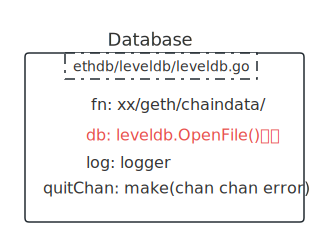
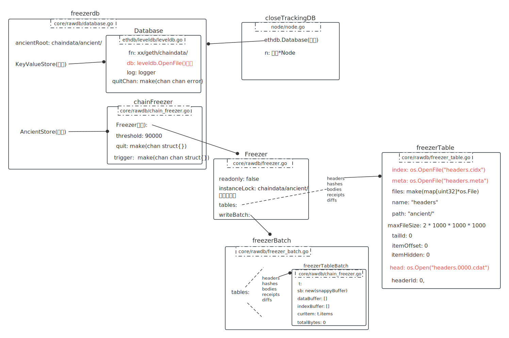

# 04 DB套

**rawdb.NewLevelDBDatabaseWithFreezer**：

```go
db, err = rawdb.NewLevelDBDatabaseWithFreezer(
  file, 			// XXX_DATA/chain_data(自己指定的)/geth/chaindata/ 传给LevelDB
  cache, 			// 0 传给LevelDB
  handles,		// 0 传给LevelDB
  ancient,		// chaindata/ancient/
  namespace,	// ""	传给LevelDB, 用来Metrics
  readonly,		// false
)
```

开始第一套：kvdb, err := leveldb.New(file, cache, handles, namespace, readonly)



<br />

第二套：frdb, err := NewDatabaseWithFreezer(kvdb, ancient, namespace, readonly)

大概返回一个这样的结构：

```javascript
---------------------
|       frdb        |           
|                   |
|    KeyValueStore--|------------- kvdb
|                   |
|    AncientStore --|------------- chinaFreezer
|                   |
---------------------
```

返回frdb。

<br />

**func (n *Node) wrapDatabase **最后一套：

```go
db = n.wrapDatabase(frdb)
```



<br />


