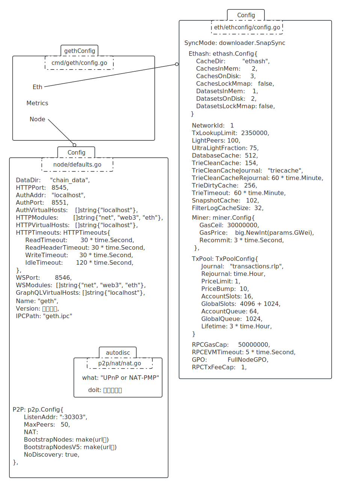
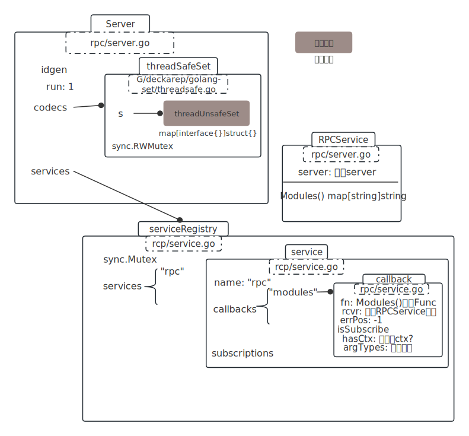
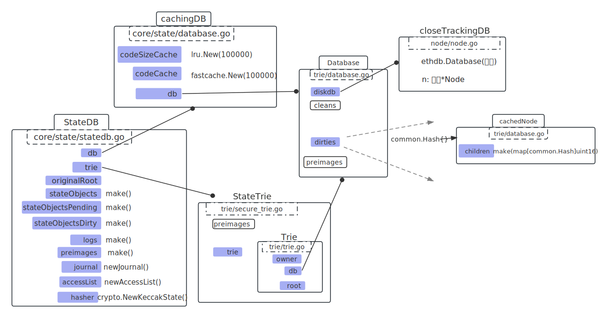

# 启动

创建私有链，启动区块链：

../build/bin/geth --datadir "./chain_data" --nodiscover console 2>>eth_output.log


参数说明:

- –nodiscover 表示该链不可被发现，即非公开的
- console 进入JavaScript 命令行模式
- 2>>eth_output.log 指定日志文件


# SetP2PConfig(ctx, &cfg.P2P)

## MainBoot URL

```go
var MainnetBootnodes = []string{
	// Ethereum Foundation Go Bootnodes
	// bootnode-aws-ap-southeast-1-001
"enode://d860a01f9722d78051619d1e2351aba3f43f943f6f00718d1b9baa4101932a1f5011f16bb2b1bb35db20d6fe28fa0bf09636d26a87d31de9ec6203eeedb1f666@18.138.108.67:30303",
  ...
}
```

enode://开头，用urlv4解析。

node分complete、incomplete：

complete：	encode://hex node id(public key)@ip:tcp port

Incomplete：encode://hex node id(public key)


## 填充BootstrapNodes

### func parseComplete(rawurl string) (*Node, error)

v4解析

```go
// 1. 解析url
u, err := url.Parse(rawurl)
{
  Scheme: "encode",
  User: "d860a01f9722d78051619d1e2351aba3f43f943f6f00718d1b9baa4101932a1f5011f16bb2b1bb35db20d6fe28fa0bf09636d26a87d31de9ec6203eeedb1f666", // 也就是pub key
  Hostname: "18.138.108.67",
  Port: 30303,
}

// 2. 构建 r
var r enr.Record
{
  pairs: [ // 按 ascii 升序排
    &pair{"ip", RLP(ip)},
    &pair{"secp256k1", RLP(User)},
    &pair{"tcp", RLP(port)},
    &pair{"udp", RLP(port)},
  ],
  signature: []byte{}, // 空的
  raw: RLP( List[ 
    					[]byte{}, // sig
    					0, 				// seq
    					"ip",			// pair.k
    					RLP(ip),	// pair.v 
    					... 
    					所有的pair  
  					]
        )
}
// 3. 构建node
&node { // p2p/enode/node.go
  r: r, // 上面的r拷贝
  id: KECCAKE256( CONCAT(pubkey.x, pubkey.y) ),
}

// 4. append
append(BootstrapNodes, &node);
```

<br />

## 填充BootstrapNodesV5

```javascript
url = "enr:-KG4QOtcP9X1FbIMOe17QNMKqDxCpm14jcX5tiOE4_TyMrFqbmhPZHK_ZPG2Gxb1GE2xdtodOfx9-cgvNtxnRyHEmC0ghGV0aDKQ9aX9QgAAAAD__________4JpZIJ2NIJpcIQDE8KdiXNlY3AyNTZrMaEDhpehBDbZjM_L9ek699Y7vhUJ-eAdMyQW_Fil522Y0fODdGNwgiMog3VkcIIjKA";

// 1. b64解码
bin = base64.RawURLEncoding.DecodeString(url[4:])

// 2. rlp解码 (原来直接把rlp编码搬了上来)
var r enr.Record
rlp.DecodeBytes(bin, r)

解码出来的r:
{
  paris: [
    &pair{"eth2", RLP(xxx)},
    &pair{"id", RLP("v4")},
    &pair{"ip", RLP(xxx)},
    &pair{"secp256k1", RLP(xxx)}, // pubkey
    &pair{"tcp", RLP(xxx)},
    &pair{"udp", RLP(xxx)},
  ],
	raw: xx,
  signature: []unit8 len:64 cap:64,
  seq: 32,
}

// 3. 构建node
node := &Node{
  r: *r拷贝上面的r,
  id: KECCAKE256( CONCAT(pubkey.x, pubkey.y) ),
}

// 4. 填充BootstrapNodesV5
append(BootstrapNodesV5, &node);
```

<br />

# setIPC(ctx, cfg)

# setHTTP(ctx, cfg)

# setGraphQL(ctx, cfg)

# setWS(ctx, cfg)

# setNodeUserIdent(ctx, cfg)

# SetDataDir(ctx, cfg)

cfg.DataDir = "chain_data"

<br />

# setSmartCard(ctx, cfg)

<br />

# 最终形成的config




# stack, err := node.New(&cfg.Node)

## inprocHandler: rpc.NewServer()

注册rcp server的处理方法



会分析RPCService实例的Method，把方法包成callback实例，包含Method的元信息。

要成为callback实例的Method有条件：

1. method必须可导出；
2. method最多返回两个参数；
3. 只返回一个参数时，必须是error类型；
4. 返回两个参数时，error作为第二个返回；

<br />

## node.accman = accounts.NewManager()

实例化Manager类，开Goro监听am.updates、am.newBackends、am.quit。


## am.AddBackend(keystore.NewKeyStore(keydir, scryptN, scryptP))

与Goro[Manager] 通信，keystore --> Goro[Manager].newBackends。

<br />


## state.New(header.Root, state.NewDatabaseWithConfig(db, nil), nil)

这个函数经常出现，究竟发生了什么？

header.Root：geneis写入的空trie树hash；

db: 最外层的db套；



在db找，0号区块的trie root，还原。

<br />

## stored是主网配置

```go
	MainnetChainConfig = &ChainConfig{
		ChainID:                       big.NewInt(1),
		HomesteadBlock:                big.NewInt(1_150_000),
		DAOForkBlock:                  big.NewInt(1_920_000),
		DAOForkSupport:                true,
		EIP150Block:                   big.NewInt(2_463_000),
		EIP150Hash:                    common.HexToHash("0x2086799aeebeae135c246c65021c82b4e15a2c451340993aacfd2751886514f0"),
		EIP155Block:                   big.NewInt(2_675_000),
		EIP158Block:                   big.NewInt(2_675_000),
		ByzantiumBlock:                big.NewInt(4_370_000),
		ConstantinopleBlock:           big.NewInt(7_280_000),
		PetersburgBlock:               big.NewInt(7_280_000),
		IstanbulBlock:                 big.NewInt(9_069_000),
		MuirGlacierBlock:              big.NewInt(9_200_000),
		BerlinBlock:                   big.NewInt(12_244_000),
		LondonBlock:                   big.NewInt(12_965_000),
		ArrowGlacierBlock:             big.NewInt(13_773_000),
		GrayGlacierBlock:              big.NewInt(15_050_000),
		TerminalTotalDifficulty:       MainnetTerminalTotalDifficulty, // 58_750_000_000_000_000_000_000
		TerminalTotalDifficultyPassed: true,
		Ethash:                        new(EthashConfig),
	}
```


**ethconfig.CreateConsensusEngine(stack, chainConfig, &ethashConfig, config.Miner.Notify, config.Miner.Noverify, chainDb),**

