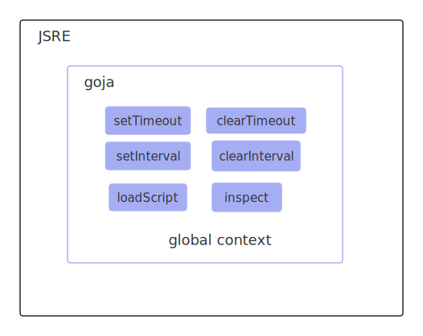

# jsre模块

路径：go-ethereum1.10/internal/jsre

<br />

# 描述

> // JSRE is a JS runtime environment embedding the goja interpreter.
>
> // It provides helper functions to load code from files, run code snippets
>
> // and bind native go objects to JS.
>
> //
>
> // The runtime runs all code on a dedicated event loop and does not expose the underlying
>
> // goja runtime directly. To use the runtime, call JSRE.Do. When binding a Go function,
>
> // use the Call type to gain access to the runtime.

JSRE是一个内嵌了goja解析器的JS运行时。（goja用来解释js代码，连通go跟js，JSRE模拟了事件循环）

<br />

# 使用

## 新建

```go
import (
	"github.com/ethereum/go-ethereum/internal/jsre"
)

console := &Console{
  client: config.Client,
  
  // 会开goro模拟事件循环
  jsre: jsre.New(config.DocRoot, config.Printer),
  ..
}
```

<br />

## 结构&jsre_test.go

```go
re := &JSRE{
		assetPath: 	"",		// 传入的资源路径
		output: output, 	// io.Writer接口
		closed:        make(chan struct{}),
		evalQueue:     make(chan *evalReq),
		stopEventLoop: make(chan bool),
		vm:            goja.New(), // 内嵌的goja
}
```

assetPath是路径，如果该路径下有test.js文件，那么可以直接执行：

```go
err := re.Exec("test.js")
```

<br />

# 总结

New一个JSRE的时候，会开goro模拟事件循环，并注入全局变量到goja。



