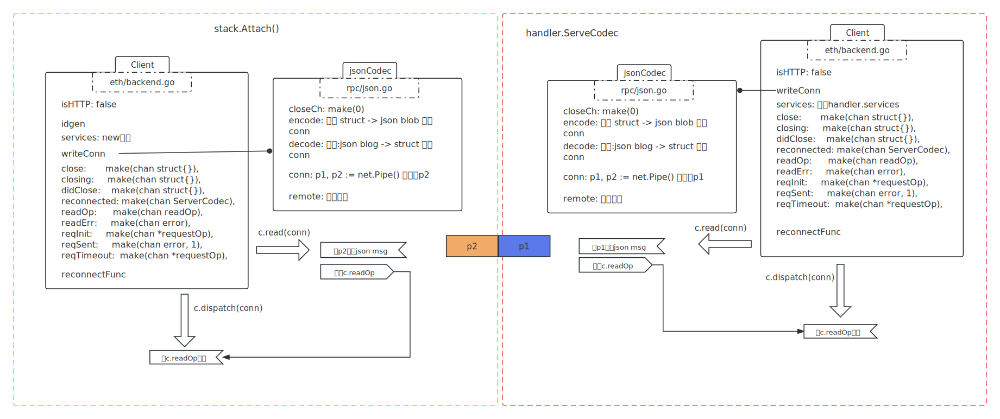
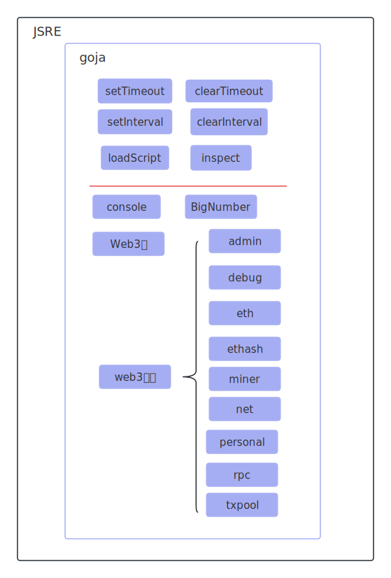
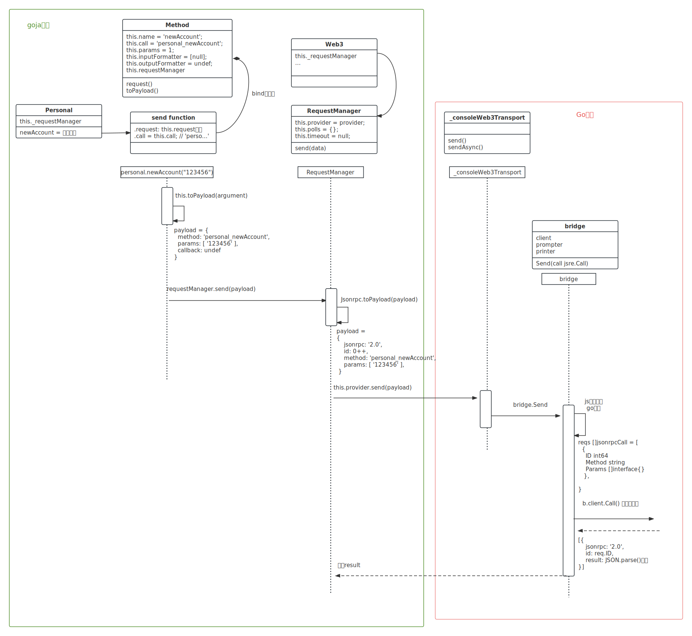
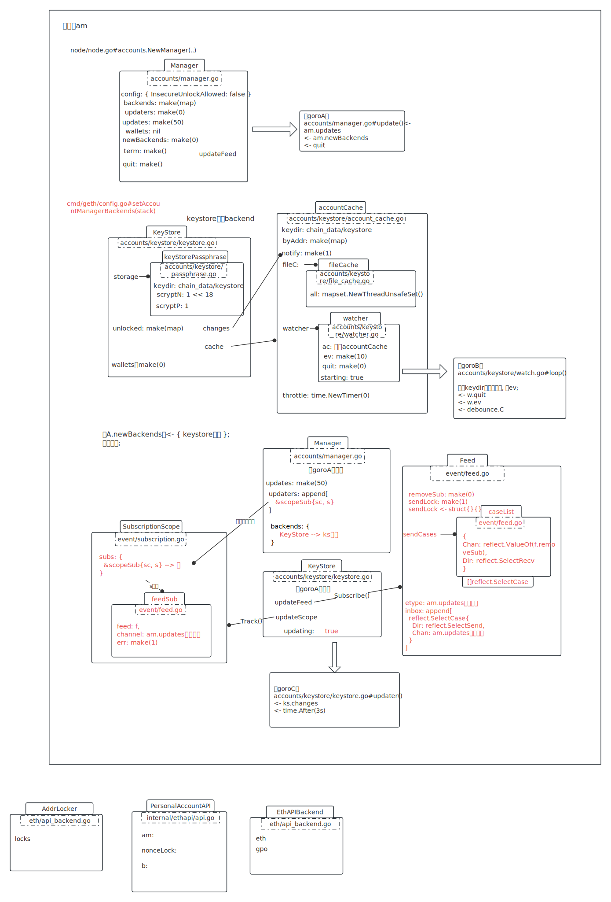

# client, err := stack.Attach()



返回client。

<br />

从p2读取一个json对象，这个json对象是 {}, 还是 [... ]\(isBatch\)，都统一解码成[]*jsonrpcMessage。

原来这就是传说中的json-rpc。

```go
type jsonrpcMessage struct {
  Version string          `json:"jsonrpc,omitempty"`
  ID      json.RawMessage `json:"id,omitempty"`
  Method  string          `json:"method,omitempty"`
  Params  json.RawMessage `json:"params,omitempty"`
  Error   *jsonError      `json:"error,omitempty"`
  Result  json.RawMessage `json:"result,omitempty"`
}
```

<br />

# c.client.SupportedModules()

组装jsonrpcMessage：

```go
msg := &jsonrpcMessage{
  Version: "2.0", 
  ID: c.nextID(), 
  Method: "rpc_modules",
  Params: nil,
}

op := &requestOp{
  ids: []json.RawMessage{msg.ID},
  resp: make(chan *jsonrpcMessage, 1),
}

```

<br />

写入p2:

```php
c.send(ctx, op, msg): op放reqInit
c.reqInit <- op       ---------------->   op := <-reqInitLock 收到op:
																							conn{
                                                handler: {
                                                  respWait[id] = op
                                                }
                                              }

接收返回, c.write(ctx, msg, false):
往p2写入msg (此时p1端应该可以读了)
c.reqSent <- err       ----------------->   err := <-c.reqSent 收到, 重置reqInitLock
接收返回;

op.wait(ctx, c):
resp := <-op.resp: 阻塞等待
```

<br />

从p1读取:

```go
func (c *Client) read(codec ServerCodec) {
  for {
    // 统一解码成[]*jsonrpcMessage
    msgs, batch, err := codec.readBatch()
    if _, ok := err.(*json.SyntaxError); ok {
      codec.writeJSON(context.Background(), errorMessage(&parseError{err.Error()}))
    }
    if err != nil {
      c.readErr <- err
      return
    } 
    // 放入
    c.readOp <- readOp{msgs, batch}
  }
}
```

接收c.readOp:

```go
case op := <-c.readOp:
  if op.batch {
    conn.handler.handleBatch(op.msgs)
  } else {
    conn.handler.handleMsg(op.msgs[0])
  }
```

<br />

得到返回值：

```go
map[string]string [
  "engine": "1.0", 
  "eth": "1.0", 
  "net": "1.0", 
  "personal": "1.0", 
  "txpool": "1.0", 
  "admin": "1.0", 
  "debug": "1.0", 
  "ethash": "1.0", 
  "miner": "1.0", 
  "rpc": "1.0", 
  "web3": "1.0", 
]
```


# console模块

路径：go-ethereum1.10/console/console.go


# 描述

> // Console is a JavaScript interpreted runtime environment. It is a fully fledged
>
> // JavaScript console attached to a running node via an external or in-process RPC
>
> // client.

## fledged

美 [fledʒd]

英 [fledʒd]

- **adj.**能飞翔的；羽翼已丰的
- **网络**. 成熟的；羽毛丰满的；羽翼丰满的

console是个js解释运行时，通过rpc附会在以太坊节点上，完全成熟可用。（console又进一步封装了JSRE，确实是个js运行时）

<br />

# 使用

```go
console := &Console{
  // rpc client, 用来中执行ethereum请求
  client:	config.Client,
  
  // 封装了goja解释器的 js运行时
  // DocRoot: "."
  jsre:               jsre.New(config.DocRoot, config.Printer),
  prompt:             ">",
  prompter:           prompt.Stdin,
  
  // 第三方库
  printer:            colorable.NewColorableStdout(),
  
  // DataDir: "chain_data"
  histPath:           filepath.Join(config.DataDir, HistoryFile),
  interactiveStopped: make(chan struct{}),
  stopInteractiveCh:  make(chan struct{}),
  signalReceived:     make(chan struct{}, 1),
  stopped:            make(chan struct{}),
}

console.init()
```



Init()之后，注入了很多变量、实例。

<br />

# personal

personal.newAccount("123456") 指定密码

这个方法在go-ethereum1.10/internal/jsre/deps/web3.js 定义.

```js
var methods = function () {
    var newAccount = new Method({
        name: 'newAccount',
        call: 'personal_newAccount',
        params: 1,
        inputFormatter: [null]
    });
}

// Method定义
var Method = function (options) {
    this.name = options.name;
    this.call = options.call;
    this.params = options.params || 0;
    this.inputFormatter = options.inputFormatter;
    this.outputFormatter = options.outputFormatter;
    this.requestManager = null;
};
```

<br />

## 整体类图&流程

web3.js personal部分类图示：



大概过程是这样：

```java
【goroA】
console等待输入:
输入personal.newAccount("123456");  【goroB】
调用goja执行语句;       ---------->   goja执行javascript语句:
                                    组装请求, jsonrpc;
                                    走到go的bridge;
                                    用bridge请求;
                                    bridge再用client写入p2管道; ----> 【goroC】
                                                                     监听到p2管道;
                                                                     读取p2内容;
                                                                     调用相应函数;
                                                                     返回值写入p1管道;
拿到返回值, 再打印出来  <----------  监听到p2管道可读, 取到返回值  <-----
  
```

<br />

## Go区域相关

personal.newAccount()相关的Go部分：accountManager、keyStore。



<br />

**backend.Subscribe(am.updates)：**

backend就是keystore，存一个updates的发送端；

之后使用ks.updateFeed.Send(event) 就是向存的updates发送数据，而是trySend非阻塞；

<br />

**func (s *PersonalAccountAPI) NewAccount(password string)**：

```go
产生一个私钥对象;
调用ks.updateFeed.Send(event)
向updates发送event       --------->   【Goro】
                                      收到, 刷新钱包;
                                      再通知am.feed.Send(event)
```

<br />

