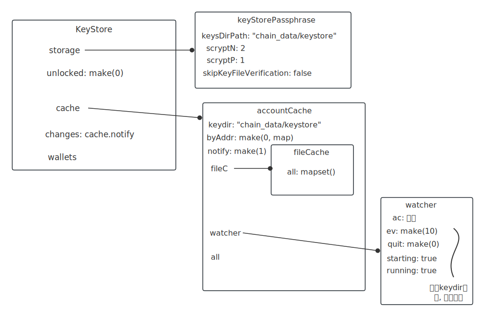

# keystore模块

路径：go-ethereum1.10/accounts/keystore/keystore.go

> // KeyStore manages a key storage directory on disk.

密钥存储的抽象。

<br />

# 前置 - passphrase

passphrase_test.go

Very-light-scrypt.json文件：

```json
{
  "address":"45dea0fb0bba44f4fcf290bba71fd57d7117cbb8",
  "crypto":{
    "cipher":"aes-128-ctr",
    // 这里是密文
    "ciphertext":"b87781948a1befd247bff51ef4063f716cf6c2d3481163e9a8f42e1f9bb74145",
    "cipherparams":{
      "iv":"dc4926b48a105133d2f16b96833abf1e"
    },
    "kdf":"scrypt",
    "kdfparams":{
      "dklen":32,
      "n":2,
      "p":1,
      "r":8,
      "salt":"004244bbdc51cadda545b1cfa43cff9ed2ae88e08c61f1479dbb45410722f8f0"
    },
    "mac":"39990c1684557447940d4c69e06b1b82b2aceacb43f284df65c956daf3046b85"
  },
  "id":"ce541d8d-c79b-40f8-9f8c-20f59616faba",
  "version":3
}

```

  传入password解密出ciphertext。

 **if _, err := DecryptKey(keyjson, password+"bad"); err == nil**

 ```javascript
1. 用password解密出ciphertext，拿到明文keyBytes；
2. key := crypto.ToECDSAUnsafe(keyBytes)  用明文创建一个私钥 ecdsa.PrivateKey；
3. 返回 &Key{ // 把返回的Key看作私钥也没问题
     			Id: id, // json文件里的id
             
   				// 公钥即是地址address
   				Address:    crypto.PubkeyToAddress(key.PublicKey),
       
   				// ecdsa.PrivateKey
   				PrivateKey: key, ( PrivateKey.D 放着的就是明文keyBytes )
   }
 ```

   <br />**if keyjson, err = EncryptKey(key, password, veryLightScryptN, veryLightScryptP)**

key：传入上面返回的&Key；N: 2；P: 1

```javascript
1. 取key.PrivateKey.D // 明文 keyBytes
2. 用新password加密
3. 返回一个新的json.Marshal(encryptedKeyJSONV3) json blob，参数都变了
```

<br />

# 前置 - account_cache

> // accountCache is a live index of all accounts in the keystore.

accountCache是keystore里面所有账号的实现索引。（keystore里存着账号）

account_cache_test.go

关键方法：

**func (ac *accountCache) accounts() []accounts.Account**：

1. 开goro 监听chain_data/keystore目录变动

2. 先扫描一遍chain_data/keytore, 加入all, byAddr
3. ac.notify <- struct{}{}

account_cache跟keystore关联，图示后面画。

<br />


# 使用

```go
// keydir: "chain_data/keystore"
// scryptN: 1 << 18
// scryptP: 1
keystore.NewKeyStore(keydir, scryptN, scryptP)
```

产生结构:



1. 开goro监听chain_data/keystore/目录变动

2. 随文件变更, ks.cache.all 相应变更


# keystore_test.go

