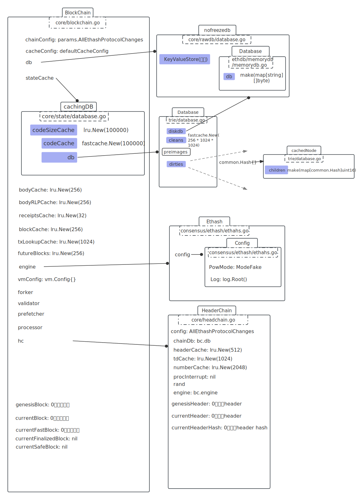

# core包下的blockchain类

路径：go-ethereum1.10/core/blockchain.go

东西太多，直接看blockchain_test.go。

<br />

# blockchain_test.go

## TestLastBlock

ethash.NewFaker()：创建一个假的共识引擎, 接受所有的block的封装。

rawdb.NewMemoryDatabase()；

params.AllEthashProtocolChanges：

```go
AllEthashProtocolChanges = &ChainConfig{
  ChainID: big.NewInt(1337), 
  HomesteadBlock: big.NewInt(0), 
  DAOForkBlock: nil, 
  DAOForkSupport: false, 
  EIP150Block: big.NewInt(0), 
  EIP150Hash: common.Hash{}, 
  EIP155Block: big.NewInt(0), 
  EIP158Block: big.NewInt(0), 
  ByzantiumBlock: big.NewInt(0), 
  ConstantinopleBlock: big.NewInt(0), 
  PetersburgBlock: big.NewInt(0), 
  IstanbulBlock: big.NewInt(0), 
  MuirGlacierBlock: big.NewInt(0), 
  BerlinBlock: big.NewInt(0), 
  LondonBlock: big.NewInt(0), 
  ArrowGlacierBlock: big.NewInt(0), 
  GrayGlacierBlock: big.NewInt(0), 
  MergeNetsplitBlock: nil, 
  ShanghaiBlock: nil, 
  CancunBlock: nil, 
  TerminalTotalDifficulty: nil, 
  TerminalTotalDifficultyPassed: false, 
  Ethash: new(EthashConfig), 
  Clique: nil
}
```

```go
	_, blockchain, err := newCanonical(
		ethash.NewFaker(), // 共识引擎
		0,
		true,
	)
```



<br />


