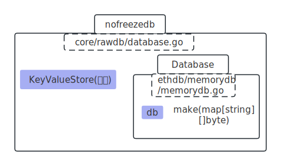
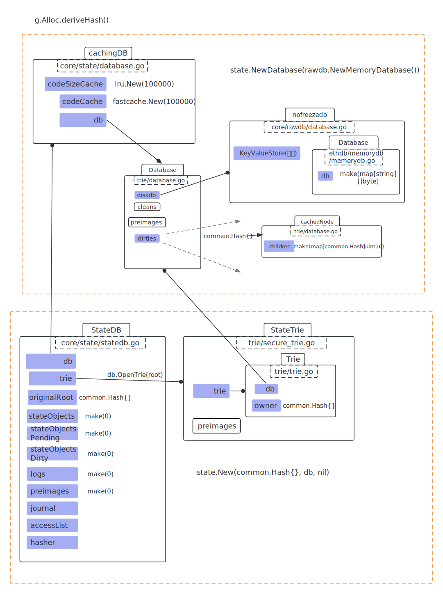
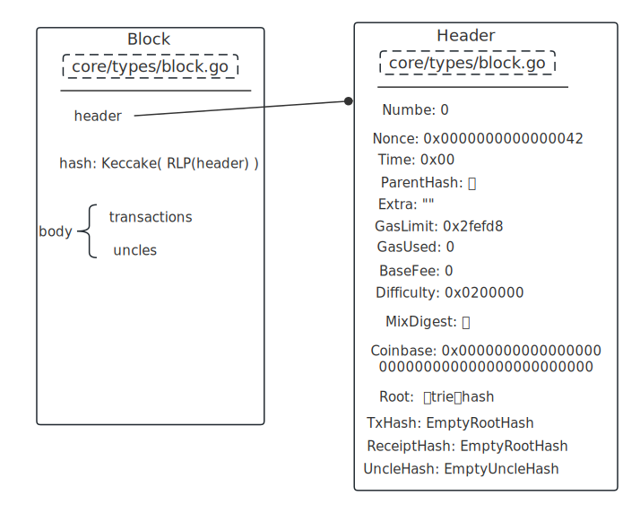
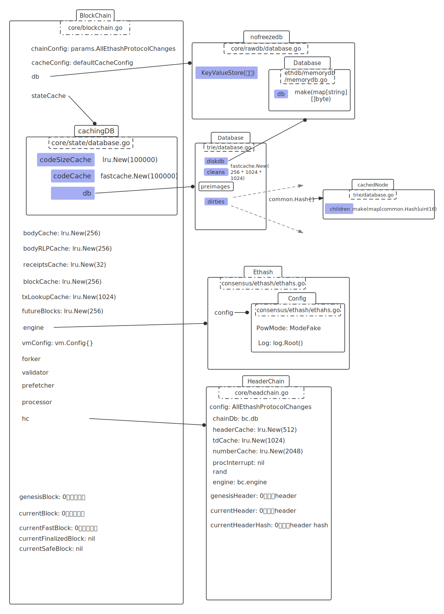

# 从blockchain_test.go重看genesis

路径：go-ethereum1.10/core/blockchain_test.go

<br />


# TestLastBlock

db  = rawdb.NewMemoryDatabase(): 简单的db



<br />

g = &Genesis{ BaseFee: big.NewInt(1000000000) }

g.Commit(db)：

​		1----  block := g.ToBlock()：

​						a---- root, err := g.Alloc.deriveHash()

​												--- db := state.NewDatabase(rawdb.NewMemoryDatabase())

​												--- statedb, err := state.New(common.Hash{}, db, nil)

​												--- statedb.Commit(false) 返回 statedb trie树root hash

​						b---- head := &types.Header{ ... }

​						c---- return types.NewBlock()

​		2---- 拿到block, 开始写入db



<br />

func (g *Genesis) ToBlock() *types.Block



<br />


emptyRoot的三种表述方式

```go
  emptyRoot = common.HexToHash("56e81f171bcc55a6ff8345e692c0f86e5b48e01b996cadc001622fb5e363b421")

string: "V\xe8\x1f\x17\x1b\xccU\xa6\xff\x83E\xe6\x92\xc0\xf8n[H\xe0\x1b\x99l\xad\xc0\x01b/\xb5\xe3c\xb4!"

[32]byte = [ 0x56, 0xe8, .... 0x21 ]
```


**block.Hash()**

Keccake( RLP(header) )  区块hash就是头部hash

```go
// 当前的blockHash是这样
blockHash := "\xad\xed\xa0\xa8>3{l\a>?\x0e\x9a\x17S\x1a\x04\x00\x9b9z\x95\x88\xc0\x93\xb6(\xf2\x1b\x8bţ"

[32]byte = [ 0xad, 0xed, 0xa0, ... 0xa3 ]

```

<br />

**g.Alloc.flush(db)**

Put：ethereum-genesis-$emptyRoot	---->  "null"

<br />

**rawdb.WriteTd(db, block.Hash(), block.NumberU64(), block.Difficulty())**

Put：h + number + blockHash + t	---> diffi

<br />

**rawdb.WriteBlock(db, block)**

Put					Body：b + number + blockHash	---> 	&Body{b.transactions, b.uncles}

Put header number：H + blockHash					--->	number

put				header：h + number + blockHash	--->	header

<br />**rawdb.WriteReceipts(db, block.Hash(), block.NumberU64(), nil)**

Put：r + number + blockHash	--->	[]

<br />**rawdb.WriteCanonicalHash(db, block.Hash(), block.NumberU64())**

Put：h + number + n	--->	blockHash

<br />**rawdb.WriteHeadBlockHash(db, block.Hash())**

Put：LastBlock	--->	blockHash

<br />**rawdb.WriteHeadFastBlockHash(db, block.Hash())**

Put：LastFast	--->	blockHash

<br />

**rawdb.WriteHeadHeaderHash(db, block.Hash())**

Put：LastHeader	--->	blockHash

<br />

**rawdb.WriteChainConfig(db, block.Hash(), config)**

Put：ethereum-config-$blockHash	--->	params.AllEthashProtocolChanges

<br />

## NewBlockChain

```go
blockchain, _ := NewBlockChain(
		db,
		nil,
		params.AllEthashProtocolChanges, // chainConfig
		engine,
		vm.Config{},
		nil,	// shouldPreserve
		nil,	// txLookupLimit
)
```



<br />

## makeBlockChain

```go
blocks := makeBlockChain(
		blockchain.CurrentBlock(), // 当前 Block
		1, 
		ethash.NewFullFaker(), 
		blockchain.db, // 与blockchain.db同指向
		0,
)
```

 statedb, err := state.New(parent.Root(), state.NewDatabase(db), nil)：用parent的hash起一个statedb，底层同指向。

block, _ := b.engine.FinalizeAndAssemble(chainreader, b.header, statedb, b.txs, b.uncles, b.receipts)：收集当前的修改,存在 statedb。


