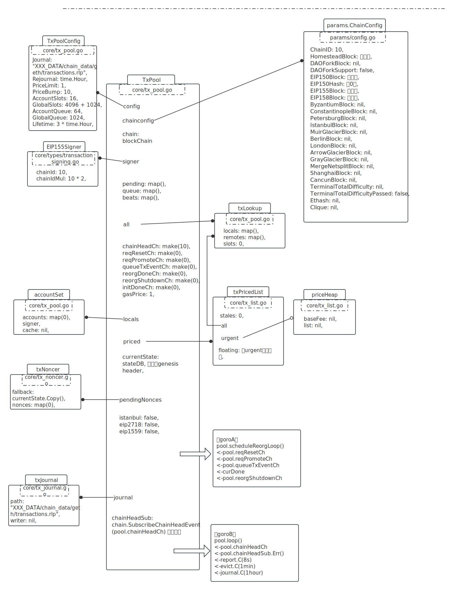
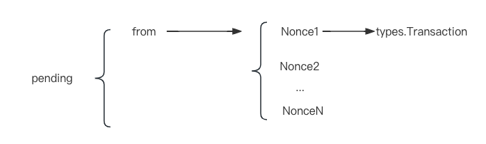
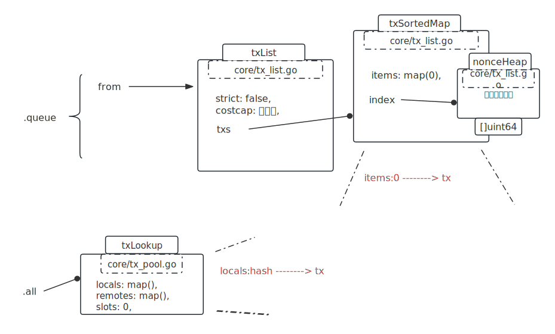

[toc]


# 启动时用到txpool的地方

## stack, cfg := makeConfigNode(ctx)

这个阶段没有用到。

<br />

## backend, eth := utils.RegisterEthService(stack, &cfg.Eth)

初始化产生的结构类图，此时blockChain里只有一个genesis块，且transactions.rlp文件里是空内容。



# 提交交易到池

以[X_solidity_01_estimageGas](./X_solidity_01_estimageGas.md)文档部署合约为交易，作以下分析。

```go
func SubmitTransaction(ctx context.Context, b Backend, tx *types.Transaction) (common.Hash, error) {
  if err := checkTxFee(tx.GasPrice(), tx.Gas(), b.RPCTxFeeCap()); err != nil {
		return common.Hash{}, err
	}
  
	if err := b.SendTx(ctx, tx); err != nil {
		return common.Hash{}, err
	}

  ...
```

检查：Gas * GasPrice / (Ether = 1e18 ) < 1。

交易花费不能超过1个eth。

```go
// 
if err := checkTxFee(tx.GasPrice(), tx.Gas(), b.RPCTxFeeCap());

```

<br />

检查：Gas * GasPrice +  Value <  pool.currentState.GetBalance(from)。

花费不能超过发起者余额。

所以在[X_solidity_01_estimageGas](./X_solidity_01_estimageGas.md)文档里，需要加多传一个gasPrice，不超过发起者余额就行。

```javascript
> cInstance = c.new({data: bytecode, gas: 100000, gasPrice: 1, from: eth.coinbase}, function(e, contract){
  if(!e){
    if(!contract.address){
      console.log("Contract transaction send: Transaction Hash: "+contract.transactionHash+" waiting to be mined...");
    }else{
      console.log("Contract mined! Address: "+contract.address);
      console.log(contract);
    }
  }else{
    console.log(e)
  }
})
```

<br />

检查：Gas > IntrinsicGas。

Gas大于基础费用。

创建合约基础费用：

```javascript
IntrinsicGas = 
  TxGasContractCreation + // 53000
  NZ(bytecode) * TxDataNonZeroGasFrontier + // 非0字节数 * 68
  Z(bytecode)* TxDataZeroGas + // 0字节数 * 4
  len(accessList) * TxAccessListAddressGas + // accessList长度 * 2400
  accessList.StorageKeys() * TxAccessListStorageKeyGas // storageKeys数量 * 1900
  
```

总共要 75208。

<br />

检查pending替换、queue替换：

pool.pending可以看作如下结构：



如果pending有相同的Nonce存在，需要看一下是否替换。

```go
// 有相同的Nonce存在
if list := pool.pending[from]; list != nil && list.Overlaps(tx) {
  
  // 看是否需要替换旧的
  // 替换规则，或的关系:
  // 1. 当前tx.GasPrice > old.GasPrice；
  // 2. 当前tx.GasPrice >= old.GasPrice * 1.1；手续费要超过10%。
  inserted, old := list.Add(tx, pool.config.PriceBump)
  
  if !inserted {
    pendingDiscardMeter.Mark(1)
    return false, ErrReplaceUnderpriced
  }
  // 删除旧的
  if old != nil {
    pool.all.Remove(old.Hash())
    pool.priced.Removed(1)
    pendingReplaceMeter.Mark(1)
  }
  // 插入当前的
  pool.all.Add(tx, isLocal)
  pool.priced.Put(tx, isLocal)
  pool.journalTx(from, tx)
  
  // 同样在queue里进行同样的判断
  pool.queueTxEvent(tx)
  log.Trace("Pooled new executable transaction", "hash", hash, "from", from, "to", tx.To())

  // Successful promotion, bump the heartbeat
  pool.beats[from] = time.Now()
  return old != nil, nil
}
```

执行完后，在queue里、all都有记录：



最终，把from添加到一个accountSet，向送channel：

```go
func (pool *TxPool) requestPromoteExecutables(set *accountSet) chan struct{} {
  select {
    // 需要等待接收才返回
    case pool.reqPromoteCh <- set:
    return <-pool.reorgDoneCh
    
  }
}
```

这里会触发queue与pending之间的迁移过程：

```go
go pool.runReorg(nextDone, reset, dirtyAccounts, queuedEvents)

```

https://learnblockchain.cn/books/geth/part2/txpool/txpromote.html

<br />

输出结果：

```javascript
Contract transaction send: Transaction Hash: 0x2d9441c9fa18f2e7328462ac0d288cb32dbc27ea8ddb5a342963938a6e40a429 waiting to be mined...
{
  abi: [{
      inputs: [],
      name: "retrieve",
      outputs: [{...}],
      stateMutability: "view",
      type: "function"
  }, {
      inputs: [{...}],
      name: "store",
      outputs: [],
      stateMutability: "nonpayable",
      type: "function"
  }],
  address: undefined,
  transactionHash: "0x2d9441c9fa18f2e7328462ac0d288cb32dbc27ea8ddb5a342963938a6e40a429"
}

```


# tx_pool_test.go

```go
var DefaultTxPoolConfig = TxPoolConfig{
	Journal:   "",
	Rejournal: time.Hour,

	PriceLimit: 1,
	PriceBump:  10,

	AccountSlots: 16,
	GlobalSlots:  4096 + 1024, // urgent + floating queue capacity with 4:1 ratio
	AccountQueue: 64,
	GlobalQueue:  1024,

	Lifetime: 3 * time.Hour,
}
```


