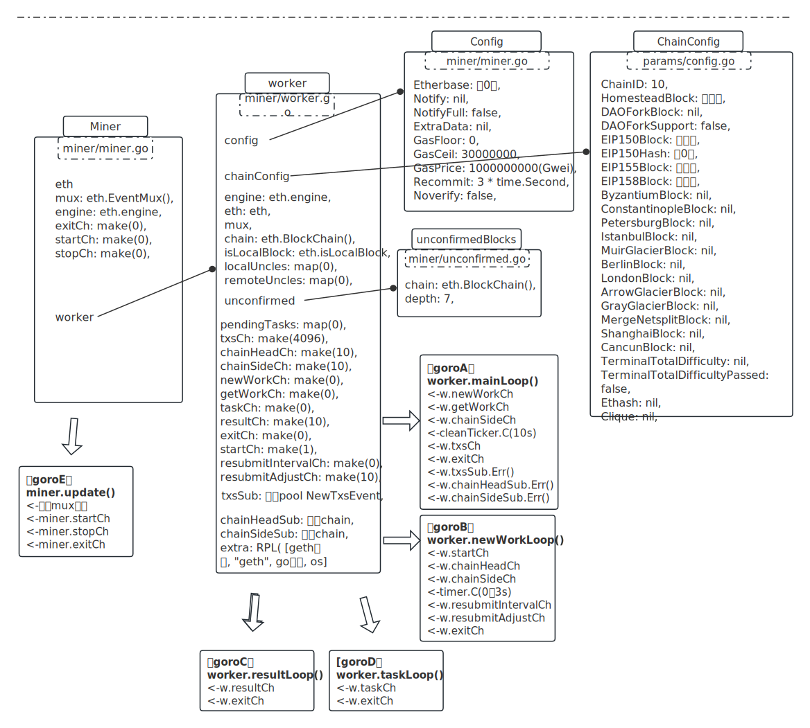
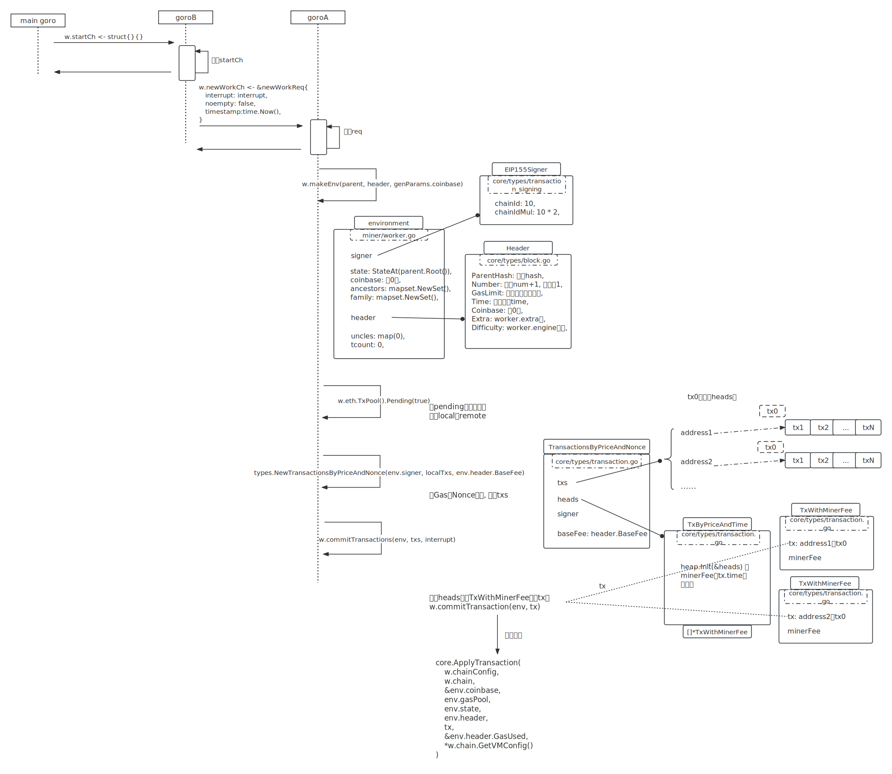
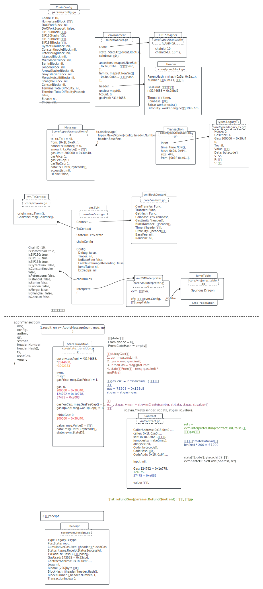
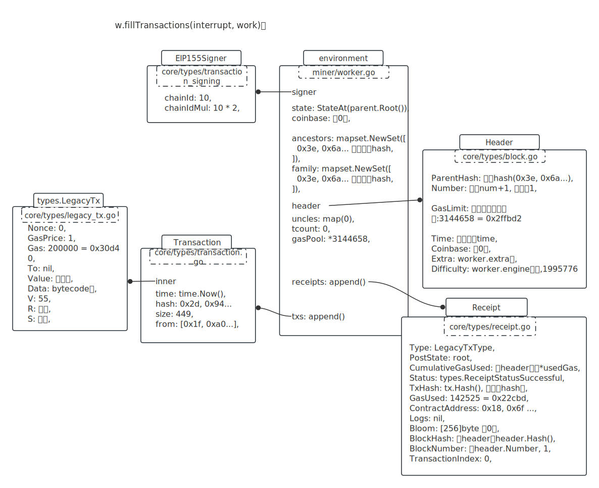
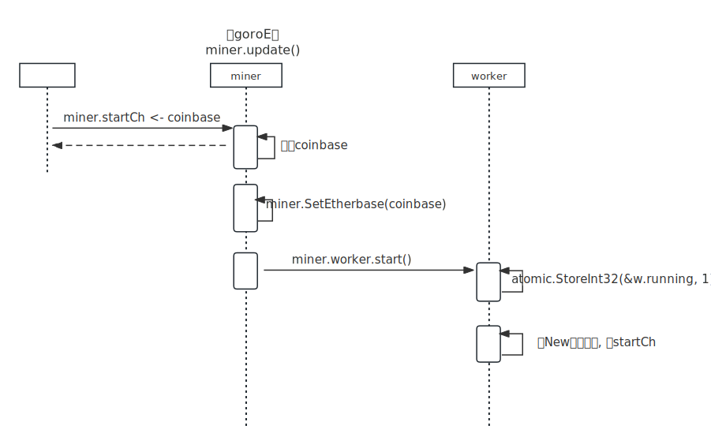
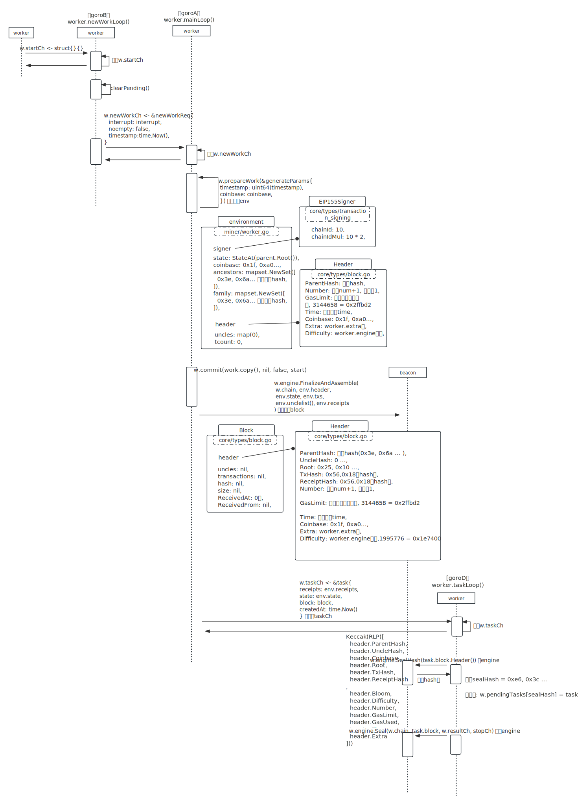
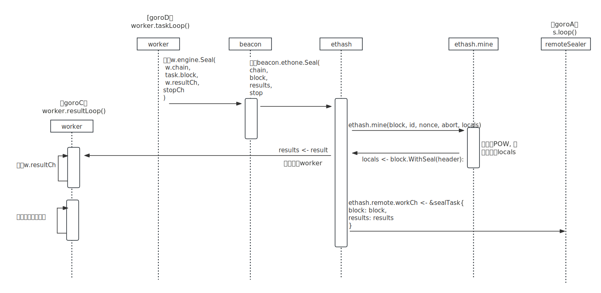

- [挖矿](#挖矿)
- [启动时用到miner的地方](#启动时用到miner的地方)
  - [backend, eth := utils.RegisterEthService(stack, \&cfg.Eth)](#backend-eth--utilsregisterethservicestack-cfgeth)
    - [commitWork开启收集交易并运行交易](#commitwork开启收集交易并运行交易)
    - [core.ApplyTransaction实现](#coreapplytransaction实现)
    - [applyTransaction实现](#applytransaction实现)
      - [st.evm.Create(sender, st.data, st.gas, st.value)实现](#stevmcreatesender-stdata-stgas-stvalue实现)
      - [ret, err := evm.interpreter.Run(contract, nil, false)过程](#ret-err--evminterpreterruncontract-nil-false过程)
      - [st.refundGas(params.RefundQuotient)](#strefundgasparamsrefundquotient)
    - [收集到receipt后](#收集到receipt后)
  - [new阶段总结](#new阶段总结)
- [miner.start(number)开挖](#minerstartnumber开挖)
  - [主过程](#主过程)
  - [变更worker.running后的交互](#变更workerrunning后的交互)
    - [前段流程图](#前段流程图)
    - [中段与beacon交互](#中段与beacon交互)

<br />

<br />


# 挖矿

继[X_solidity_01_estimageGas](./X_solidity_01_estimageGas.md)部署合约、[tx_pool文档](./X_12_txpool.md)入池后，开始挖矿。


# 启动时用到miner的地方

## backend, eth := utils.RegisterEthService(stack, &cfg.Eth)

形成的类图结构：



需要注意的是，在new worker后，启动四个goro，之后main goro放进一个w.startCh，所以需要补上如下交互：



### commitWork开启收集交易并运行交易

```go
func (w *worker) commitWork(interrupt *int32, noempty bool, timestamp int64) {
  start := time.Now()

  // 返回一个env
  work, err := w.prepareWork(&generateParams{
    timestamp: uint64(timestamp),
    coinbase:  coinbase,
  })

  // 执行transaction, 收集receipts进work
  err = w.fillTransactions(interrupt, work)
  ...
}
```

针对单个transaction，调用的是commitTransaction：

```go
// miner/worker.go
func (w *worker) commitTransaction(env *environment, tx *types.Transaction) ([]*types.Log, error) {
  snap := env.state.Snapshot()
  
  receipt, err := core.ApplyTransaction(
    w.chainConfig,
    w.chain, 
    &env.coinbase, 
    env.gasPool, 
    env.state, 
    env.header, 
    tx, 
    &env.header.GasUsed, 
    *w.chain.GetVMConfig()
  )
  
  if err != nil {
    env.state.RevertToSnapshot(snap)
    return nil, err
  }
  
  // 收据都放在env里
  env.txs = append(env.txs, tx)
  env.receipts = append(env.receipts, receipt)
  
  return receipt.Logs, nil
}
```

关键就在core.ApplyTransaction。

整体过程图:



<br />

### core.ApplyTransaction实现

代码短短几行：

```go
// core/state_processor.go
func ApplyTransaction(config *params.ChainConfig, bc ChainContext, author *common.Address, gp *GasPool, statedb *state.StateDB, header *types.Header, tx *types.Transaction, usedGas *uint64, cfg vm.Config) (*types.Receipt, error) {
  
  msg, err := tx.AsMessage(types.MakeSigner(config, header.Number), header.BaseFee)
  
  // Create a new context to be used in the EVM environment
  blockContext := NewEVMBlockContext(header, bc, author)
  vmenv := vm.NewEVM(blockContext, vm.TxContext{}, statedb, config, cfg)
  return applyTransaction(
    msg,
    config, 
    author, 
    gp, 
    statedb, 
    header.Number, 
    header.Hash(), 
    tx,
    usedGas, 
    vmenv,
  )
}
```

<br />

### applyTransaction实现

```go
// core/state_processor.go
func applyTransaction(msg types.Message, config *params.ChainConfig, author *common.Address, gp *GasPool, statedb *state.StateDB, blockNumber *big.Int, blockHash common.Hash, tx *types.Transaction, usedGas *uint64, evm *vm.EVM) (*types.Receipt, error) {
  
  /**
  1. 收个基础费用IntrinsicGas, 减掉st.gas = st.gas - IntrinsicGas;
  2. 调用 ret, _, st.gas = st.evm.Create(sender, st.data, st.gas, st.value);
  
  3. 调用 st.refundGas(params.RefundQuotient);
  
  4. state增加coinbase余额: st.state.AddBalance(st.evm.Context.Coinbase, st.gasUsed);
  
  5. 返回 { ret, usedGas };
  */
  result, err := ApplyMessage(evm, msg, gp)
  
  var root []byte
  
  // 持久化state
  root = statedb.IntermediateRoot(config.IsEIP158(blockNumber)).Bytes()
  
  // 修改header.GasUsed
  *usedGas += result.UsedGas
  
  // 创建收据receipt
  receipt := &types.Receipt{
    Type: tx.Type(), 
    PostState: root, 
    CumulativeGasUsed: *usedGas, // 取自 header.GasUsed
  }
  
  // 设置receipt一系列值
  ...
  
  // 返回 { receipt, err }
  return receipt, err

}
```

<br />

#### st.evm.Create(sender, st.data, st.gas, st.value)实现

参数很简单，sender：交易发起者；

st.data：bytecode值；

st.gas：此次交易的最多消耗gas；

st.value：传入的value。创建合约是空盒子。

```go
// core/vm/evm.go
func (evm *EVM) Create(caller ContractRef, code []byte, gas uint64, value *big.Int) (ret []byte, contractAddr common.Address, leftOverGas uint64, err error) {
  
  // 合约地址 = keccak256( rpl(address, nonce) )
  // [ 0x18, 0x6f, ... ]
  contractAddr = crypto.CreateAddress(
    caller.Address(), 
    evm.StateDB.GetNonce(caller.Address()),
  )
  
  // 这里会进行如下操作:
  /**
  1. state增加from nonce: evm.StateDB.SetNonce(caller.Address(), nonce+1);
  
  2. state创建合约Account: evm.StateDB.CreateAccount(address);
  3. state设置合约nonce: evm.StateDB.SetNonce(address, 1);
  
  4. state减少from balance: db.SubBalance(sender, value);
     state增加合约 balance: db.AddBalance(recipient, value);
  
  5. 新建合约对象: contract := NewContract(caller, AccountRef(address), value, gas);
  
  6. 解释执行: ret, err := evm.interpreter.Run(contract, nil, false);
     其中, 消耗的Gas包括: 执行的OpCode + mem扩展(按字来) + copy bytecode;
     返回的ret相当于 = bytecode[32:], len(ret) = 336个字节;
     
  7. 再收一个创建合约费用: createDataGas = len(ret) * 200 = 67200;
  
  8. state设置合约Code: evm.StateDB.SetCode(address, ret);
  9. 返回 ret, address(合约地址), 合约当前剩余Gas, err;
  */
  return evm.create(
    caller, 
    &codeAndHash{code: code}, 
    gas,
    value, 
    contractAddr, 
    CREATE,
  )
}
```

<br />

#### ret, err := evm.interpreter.Run(contract, nil, false)过程

接上面第6步过程。

取bytecode解释执行。bytecode值、JumpTable在 [X_solidity_01_estimageGas](./X_solidity_01_estimageGas.md)有说明。


最终返回的ret是mem[0, 336]，也就是相当于是bytecode[32:]。

<br />

#### st.refundGas(params.RefundQuotient)

params.RefundQuotient: 2。

```go
// core/state_transition.go
func (st *StateTransition) refundGas(refundQuotient uint64) {
  
  // gasUsed = initialGas - gas = 71262 = 0x1165e
	refund := st.gasUsed() / refundQuotient
  
  // 此时st.state.GetRefund()返回0
	if refund > st.state.GetRefund() {
		refund = st.state.GetRefund() // 0
	}
  
	st.gas += refund

	remaining := new(big.Int).Mul(new(big.Int).SetUint64(st.gas), st.gasPrice)
  
  // state再加回余额
	st.state.AddBalance(st.msg.From(), remaining)

  // 返回到池
	st.gp.AddGas(st.gas)
}
```

<br />

### 收集到receipt后

```go
func (w *worker) commitWork(interrupt *int32, noempty bool, timestamp int64) {
  ...
  // 执行transaction, 收集receipts进work
  err = w.fillTransactions(interrupt, work)
  
  // 再次commit, 不影响, 因为此时还没有running状态
  w.commit(work.copy(), w.fullTaskHook, true, start)
  
  w.current = work
}
```

此时的类图：



## new阶段总结

new阶段会有一个`w.newWorkCh`信号，执行`w.commitWork(req.interrupt, req.noempty, req.timestamp)`收集txPool里面的pending tx，并逐个运行，并每个tx的运行结果产生的receipt收集起来。

此时还没有开始挖矿。

<br />

# miner.start(number)开挖

```javascript
// 开一条goro挖
> miner.start(1)
```

根据[X_06_inprocHandler](./X_06_inprocHandler.md)，对应的Go代码在eth/api.go。

```go
// eth/api.go
func (api *MinerAPI) Start(threads *int) error {
  if threads == nil {
    return api.e.StartMining(runtime.NumCPU())
  }
  return api.e.StartMining(*threads)
}
```

## 主过程



最终调用的是miner.worker.start()方法。

```go
// miner/worker.go
func (w *worker) start() {
  atomic.StoreInt32(&w.running, 1)
  
  // 与new阶段一样放个
  w.startCh <- struct{}{}
}
```

## 变更worker.running后的交互

### 前段流程图



在调用`w.engine.Seal(w.chain, task.block, w.resultCh, stopCh)`时，又会涉及到跟共识引擎beacon的交互。单独拿出来。

<br />

### 中段与beacon交互



其中POW的过程在[这里](./X_pow过程.md)。

之后就就写区块、广播区块了。

