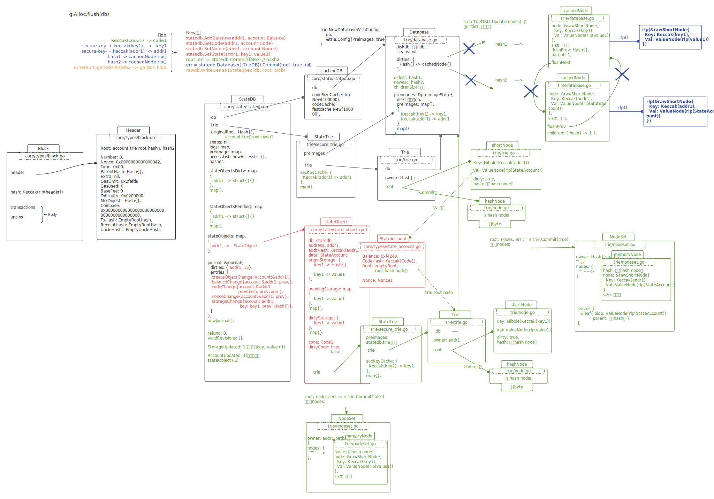

# XXX_DATA/genesis.json

```json
{
  "config": {
    "chainId": 10,
    "homesteadBlock": 0,
    "eip150Block": 0,
    "eip155Block": 0,
    "eip158Block": 0
  },
  "alloc": {
    "0x1fa0bb39d82a760ff8a53d1abbc544041bb8b546": {
      "balance": "0xf4240",
      "storage": {
        "0x000001": "0x000002"
      }
    },
    "0xcad234afd3b0a96c8f25cb5de9da3e243d063429": {
      "balance": "0xf4240",
      "storage": {
        "0x000003": "0x000004"
      }
    }
  },
  "coinbase": "0x0000000000000000000000000000000000000000",
  "difficulty": "0x0200000",
  "extraData": "",
  "gasLimit": "0x2fefd8",
  "nonce": "0x0000000000000042",
  "mixhash": "0x0000000000000000000000000000000000000000000000000000000000000000",
  "parentHash": "0x0000000000000000000000000000000000000000000000000000000000000000",
  "timestamp": "0x00"
}
```

<br />

XXX_DATA/chain_data/keystore/UTC--2023-09-14T02-06-08.120067000Z--1fa0bb39d82a760ff8a53d1abbc544041bb8b546

```json
{
  "address":"1fa0bb39d82a760ff8a53d1abbc544041bb8b546",
  "crypto":{
    "cipher":"aes-128-ctr",
    "ciphertext":"9597a1213af29238d3db7ff0155f220d8d1500be4cfa773a8d66ec1c5de113a6",
    "cipherparams":{
      "iv":"a7a244997899838d601a787587a1379a"
    },
    "kdf":"scrypt",
    "kdfparams":{
      "dklen":32,
      "n":262144,
      "p":1,
      "r":8,
      "salt":"42ddc8ce3f1780a14bd666b915c3bafd865f011d0301a59ba7a425d65d6a114a"
    },
    "mac":"958bde58d4ce87c1d3e0a762ac0c28434f01f50c54edc2a809d0042f63e93c4b"
  },
  "id":"e289cb75-7fd5-4dc0-adc7-c680db044084",
  "version":3
}
```

<br />

XXX_DATA/chain_data/keystore/UTC--2023-09-19T09-12-42.290118000Z--cad234afd3b0a96c8f25cb5de9da3e243d063429

```json
{
  "address":"cad234afd3b0a96c8f25cb5de9da3e243d063429",
  "crypto":{
    "cipher":"aes-128-ctr",
    "ciphertext":"5f386947c644ed0ce764a433ca0e8146a18a263309f9e2ebc19644b056361c60",
    "cipherparams":{
      "iv":"2b7093b84023c1b424c0407ee938eae1"
    },
    "kdf":"scrypt",
    "kdfparams":{
      "dklen":32,
      "n":262144,
      "p":1,
      "r":8,
      "salt":"c2c84efb4350c17b532d0d65086125364d91a8f851c27348a76bb4512c225348"
    },
    "mac":"bb5347e204b367b9909d558dbb9ecfba4c47348a76b9f482be8175357ff4abb4"
  },
  "id":"b4490de5-a205-4597-8a61-b00e8e2916e7",
  "version":3
}
```

<br />

genesis.json里配置的两个account，在init时，并没有检查磁盘是否存在。也就是可以随意配一个account了？

如何通过phrase找回私钥（找回私钥也就是找回了公钥，也就找回了钱包地址）？

<br />

# 以genesis.json init 写入的创世区块

命令

```shell
cd XXX_DATA
../build/bin/geth --datadir "./chain_data" init genesis.json
```

<br />



<br />

## g.Alloc.flush(db) 写入db信息 

```javascript
Keccak(code1) -> code1
secure-key- + keccak(key1)  ->  key1
secure-key- + keccak(addr1) -> addr1

hash1 -> rlp(&rawShortNode{
             Key: Keccak(key1), Val: ValueNode(rlp(value1))
         })

// hash2也就是Header.Root
hash2( -> rlp(&rawShortNode{
             Key: Keccak(addr1), 
             Val: ValueNode(rlp(StateAccount{
                                Balance: 0xf4240,
                                CodeHash: Keccak(Code1),
                                Root: root hash node值,
                                Nonce: Nonce1
                            })
             )
          })

ethereum-genesis-$hash2 --> ga json blob{
    "0x1fa0bb39d82a760ff8a53d1abbc544041bb8b546": {
      "balance": "0xf4240",
      "storage": {
        "0x000001": "0x000002"
      }
    },
    "0xcad234afd3b0a96c8f25cb5de9da3e243d063429": {
      "balance": "0xf4240",
      "storage": {
        "0x000003": "0x000004"
      }
    }
}
```

<br />

## 写block db信息

blockHash = Keccak(rlp(header))

```go
// rawdb.WriteTd(db, block.Hash(), block.NumberU64(), block.Difficulty())
h + 0(Number) + blockHash + t --> rlp(0x0200000)


// rawdb.WriteBlock(db, block)
b + 0(Number) + blockHash -->	rlp(&Body{nil, nil} ) // body
H + blockHash	-->	binary.BigEndian(0)
h + 0(Number) + blockHash	-->	rlp(header)


// rawdb.WriteReceipts(db, block.Hash(), block.NumberU64(), nil)
r + 0(Number) + blockHash	-->	rlp([])


// rawdb.WriteCanonicalHash(db, block.Hash(), block.NumberU64())
h + 0(Number) + n	--> blockHash


// rawdb.WriteHeadBlockHash(db, block.Hash())
LastBlock	--> blockHash

// rawdb.WriteHeadFastBlockHash(db, block.Hash())
LastFast	--> blockHash

// rawdb.WriteHeadHeaderHash(db, block.Hash())
LastHeader  -->	blockHash

// rawdb.WriteChainConfig(db, block.Hash(), config)
ethereum-config-$blockHash	-->	json.Marshal(
  {
    "chainId": 10,
    "homesteadBlock": 0,
    "eip150Block": 0,
    "eip155Block": 0,
    "eip158Block": 0
  }
)

```

<br />

github.com/ethereum/go-ethereum/common.Hash [62,106,111,118,135,6,228,5,75,122,247,87,165,98,215,73,254,33,157,25,190,39,3,161,50,81,252,214,220,199,101,75]

```
params.ChainConfig {
ChainID: *math/big.Int {neg: false, abs: math/big.nat len: 1, cap: 1, [10]}, 
HomesteadBlock: *math/big.Int {neg: false, abs: math/big.nat len: 0, cap: 0, nil}, DAOForkBlock: *math/big.Int nil, 
DAOForkSupport: false, 
EIP150Block: *math/big.Int {neg: false, abs: math/big.nat len: 0, cap: 0, nil}, 
EIP150Hash: github.com/ethereum/go-ethereum/common.Hash [0,0,0,0,0,0,0,0,0,0,0,0,0,0,0,0,0,0,0,0,0,0,0,0,0,0,0,0,0,0,0,0], 
EIP155Block: *math/big.Int {neg: false, abs: math/big.nat len: 0, cap: 0, nil}, 
EIP158Block: *math/big.Int {neg: false, abs: math/big.nat len: 0, cap: 0, nil}, ByzantiumBlock: *math/big.Int nil, 
ConstantinopleBlock: *math/big.Int nil, 
PetersburgBlock: *math/big.Int nil, 
IstanbulBlock: *math/big.Int nil, 
MuirGlacierBlock: *math/big.Int nil, 
BerlinBlock: *math/big.Int nil, 
LondonBlock: *math/big.Int nil, 
ArrowGlacierBlock: *math/big.Int nil, 
GrayGlacierBlock: *math/big.Int nil, 
MergeNetsplitBlock: *math/big.Int nil, 
ShanghaiBlock: *math/big.Int nil, 
CancunBlock: *math/big.Int nil, 
TerminalTotalDifficulty: *math/big.Int nil, 
TerminalTotalDifficultyPassed: false, 
Ethash: *github.com/ethereum/go-ethereum/params.EthashConfig nil, 
Clique: *github.com/ethereum/go-ethereum/params.CliqueConfig nil
}
```

