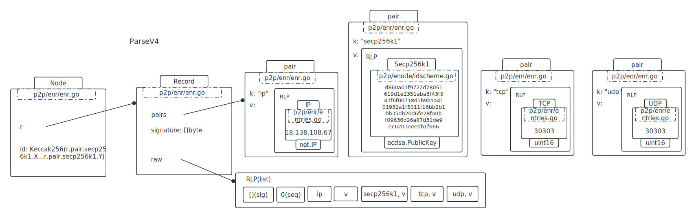
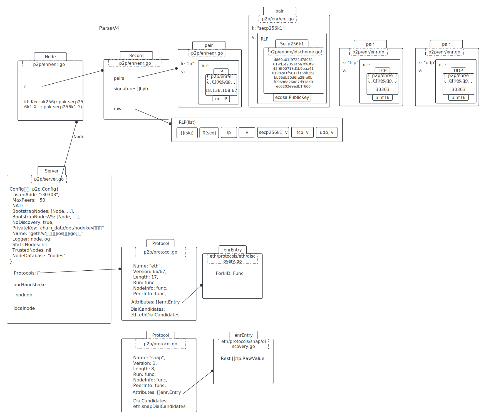

# config

SetP2PConfig	--->	setBootstrapNodes

## MainBoot URL

```go
var MainnetBootnodes = []string{
	// Ethereum Foundation Go Bootnodes
	// bootnode-aws-ap-southeast-1-001
"enode://d860a01f9722d78051619d1e2351aba3f43f943f6f00718d1b9baa4101932a1f5011f16bb2b1bb35db20d6fe28fa0bf09636d26a87d31de9ec6203eeedb1f666@18.138.108.67:30303",
  ...
}
```

enode://开头，用urlv4解析。

node分complete、incomplete：

complete：	encode://hex node id(public key)@ip:tcp port

Incomplete：encode://hex node id(public key)

<br />

## 填充BootstrapNodes

v4解析

```go
// 1. 解析url
u, err := url.Parse(rawurl)
{
  Scheme: "encode",
  User: "d860a01f9722d78051619d1e2351aba3f43f943f6f00718d1b9baa4101932a1f5011f16bb2b1bb35db20d6fe28fa0bf09636d26a87d31de9ec6203eeedb1f666", // 也就是pub key
  Hostname: "18.138.108.67",
  Port: 30303,
}

// 2. 构建 r
var r enr.Record
{
  pairs: [ // 按 ascii 升序排
    &pair{"ip", RLP(ip)},
    &pair{"secp256k1", RLP(User)},
    &pair{"tcp", RLP(port)},
    &pair{"udp", RLP(port)},
  ],
  signature: []byte{}, // 空的
  raw: RLP( List[ 
    					[]byte{}, // sig
    					0, 				// seq
    					"ip",			// pair.k
    					RLP(ip),	// pair.v 
    					... 
    					所有的pair  
  					]
        )
}
// 3. 构建node
&node { // p2p/enode/node.go
  r: r, // 上面的r拷贝
  id: KECCAKE256( CONCAT(pubkey.x, pubkey.y) ),
}

// 4. append
append(BootstrapNodes, &node);
```

<br />

形成的Node类图



<br />

## 填充BootstrapNodesV5

```javascript
url = "enr:-KG4QOtcP9X1FbIMOe17QNMKqDxCpm14jcX5tiOE4_TyMrFqbmhPZHK_ZPG2Gxb1GE2xdtodOfx9-cgvNtxnRyHEmC0ghGV0aDKQ9aX9QgAAAAD__________4JpZIJ2NIJpcIQDE8KdiXNlY3AyNTZrMaEDhpehBDbZjM_L9ek699Y7vhUJ-eAdMyQW_Fil522Y0fODdGNwgiMog3VkcIIjKA";

// 1. b64解码
bin = base64.RawURLEncoding.DecodeString(url[4:])

// 2. rlp解码 (原来直接把rlp编码搬了上来)
var r enr.Record
rlp.DecodeBytes(bin, r)

解码出来的r:
{
  paris: [
    &pair{"eth2", RLP(xxx)},
    &pair{"id", RLP("v4")},
    &pair{"ip", RLP(xxx)},
    &pair{"secp256k1", RLP(xxx)}, // pubkey
    &pair{"tcp", RLP(xxx)},
    &pair{"udp", RLP(xxx)},
  ],
	raw: xx,
  signature: []unit8 len:64 cap:64,
  seq: 32,
}

// 3. 构建node
node := &Node{
  r: *r拷贝上面的r,
  id: KECCAKE256( CONCAT(pubkey.x, pubkey.y) ),
}

// 4. 填充BootstrapNodesV5
append(BootstrapNodesV5, &node);
```

<br />

万事具备，只欠启动：



<br />

# server.Start()

