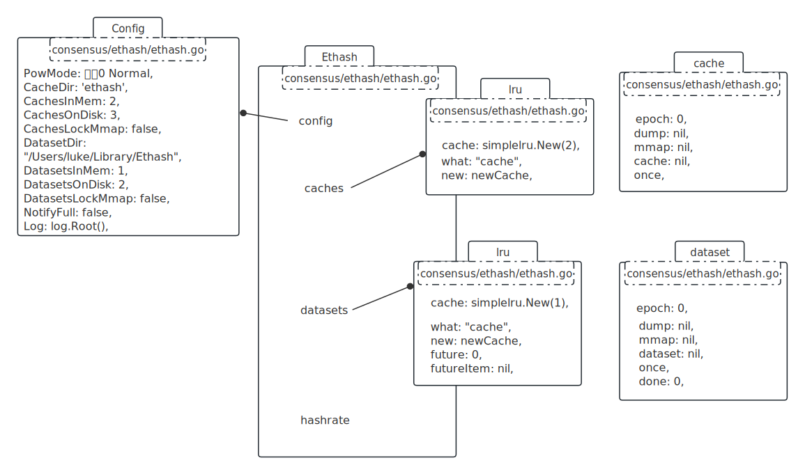
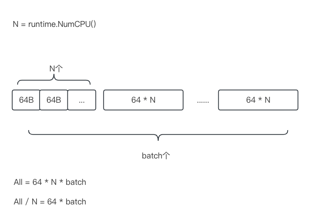

- [名词解释](#名词解释)
- [参考](#参考)
- [涉及类图](#涉及类图)
- [整体过程](#整体过程)
- [hashimotoFull](#hashimotofull)
- [生成dataset](#生成dataset)
  - [生成dataset](#生成dataset-1)
  - [generateDatasetItem](#generatedatasetitem)
  - [生成cache](#生成cache)


# 名词解释

epoch：纪元，每30000个块为一个纪元。


# 参考

https://yangzhe.me/2019/02/14/ethereum-ethash-theory/

https://yangzhe.me/2019/02/18/ethereum-ethash-code/


# 涉及类图




# 整体过程

```go
// consensus/ethash/sealer.go

func (ethash *Ethash) mine(
  block *types.Block,       // 新块
  id int,                   // 线程序号 0,1,2,3...
  seed uint64,              // 种子随机数
  abort chan struct{}, 
  found chan *types.Block,
) {
  
  var (
    header  = block.Header()
    
    // 头heash, 256位, 即32bytes
    hash    = ethash.SealHash(header).Bytes()
    target  = new(big.Int).Div(two256, header.Difficulty)
    number  = header.Number.Uint64()
    
    // 1G的数据集
    dataset = ethash.dataset(number, false)
  )
  
  var (
    attempts  = int64(0)
    nonce     = seed
    powBuffer = new(big.Int)
  )
  
search:
  for {
    select {
      default:
      attempts++
      digest, result := hashimotoFull(dataset.dataset, hash, nonce)
      
      // 满足难度
      if powBuffer.SetBytes(result).Cmp(target) <= 0 {
        header = types.CopyHeader(header)
        header.Nonce = types.EncodeNonce(nonce)
        
        // 存一下digest, 用来验证
        header.MixDigest = common.BytesToHash(digest)
        found <- block.WithSeal(header)
      }
      nonce++
    }
  }
  runtime.KeepAlive(dataset)
}
```

如何确定是否满足难度？

设定一个target = $2^{256}$ / Difficulty，Difficulty越大，target越小，hash出来的结果越难满足。

<br />

简述一下整体过程：

seed = Hash(RLP(head)) + nonce

digest = Gn( seed + dataset ), 一系列的变幻

result = Hash( digest + seed )

<br />

header保存的有nonce、digest、seed也可知，不难反推出验证办法：

seed = Hash(RLP(head)) + nonce

digestV = Gn( seed  + dataset )

判断digestV是否与header.digest相等即可。

<br />

# hashimotoFull

```go
// consensus/ethash/algorithm.go

func hashimotoFull(dataset []uint32, hash []byte, nonce uint64) ([]byte, []byte) {
  lookup := func(index uint32) []uint32 {
    offset := index * hashWords // hashWords:16
    return dataset[offset : offset+hashWords]
  }
  return hashimoto(hash, nonce, uint64(len(dataset))*4, lookup)
}

// hash: 长度32bytes
// size: dataset数据集1G的字节大小
func hashimoto(hash []byte, nonce uint64, size uint64, lookup func(index uint32) []uint32) ([]byte, []byte) {
  
  // mixBytes: 128
  rows := uint32(size / mixBytes)
  
  // seed = Keccak512( hash + nonce )
  seed := make([]byte, 40)
  copy(seed, hash)
  binary.LittleEndian.PutUint64(seed[32:], nonce)
  seed = crypto.Keccak512(seed)
  

  seedHead := binary.LittleEndian.Uint32(seed)
  
  // 相当于 mix := make([]byte, mixBytes)
  mix := make([]uint32, mixBytes/4)
  for i := 0; i < len(mix); i++ {
    // 用seed填充
    mix[i] = binary.LittleEndian.Uint32(seed[i%16*4:])
  }
  
  // 总之就是用mix, dataset填充tmp
  temp := make([]uint32, len(mix))
  for i := 0; i < loopAccesses; i++ { // 64
    parent := fnv(uint32(i)^seedHead, mix[i%len(mix)]) % rows
    for j := uint32(0); j < mixBytes/hashBytes; j++ {
      copy(temp[j*hashWords:], lookup(2*parent+j))
    }
    fnvHash(mix, temp)
  }
  
  for i := 0; i < len(mix); i += 4 {
    mix[i/4] = fnv(fnv(fnv(mix[i], mix[i+1]), mix[i+2]), mix[i+3])
  }
  mix = mix[:len(mix)/4]
  
  digest := make([]byte, common.HashLength) // 32
  for i, val := range mix {
    binary.LittleEndian.PutUint32(digest[i*4:], val)
  }
  return digest, crypto.Keccak256(append(seed, digest...))
}
```


# 生成dataset

```go
// consensus/ethash/ethash.go

func (d *dataset) generate(dir string, limit int, lock bool, test bool) {
  
  // 拿到epoch对应的cache size, 单位byte
  // 比如说, 0 epoch对应的是: 1677689 = 16M
  csize := cacheSize(d.epoch*epochLength + 1)
  
  // 拿到epoch对应的dataset size, 单位byte
  // 比如说, 0 epoch对应的是: 1073739904 = 1G
  dsize := datasetSize(d.epoch*epochLength + 1)
  
  // 拿到epoch对应的seed, 32byte长度
  seed := seedHash(d.epoch*epochLength + 1)
  
  // 转成uint32的切片, 本质是一样的
  cache := make([]uint32, csize/4)
  
  // 先生成cache, 具体看下小节
  generateCache(cache, d.epoch, seed)
  
  // 具体的生成
  d.dataset = make([]uint32, dsize/4)
  generateDataset(d.dataset, d.epoch, cache)
}
```

<br />

## 生成dataset

```go
func generateDataset(dest []uint32, epoch uint64, cache []uint32) {
  var dataset []byte
  datasetHdr := (*reflect.SliceHeader)(unsafe.Pointer(&dataset))
  destHdr := (*reflect.SliceHeader)(unsafe.Pointer(&dest))
  
  // 跟cache一样
  datasetHdr.Data = destHdr.Data
  datasetHdr.Len = destHdr.Len * 4
  datasetHdr.Cap = destHdr.Cap * 4

  // 开多少条goro跑
  threads := runtime.NumCPU()
  size := uint64(len(dataset))

  for i := 0; i < threads; i++ {
    go func(id int) {
      defer pend.Done()
      keccak512 := makeHasher(sha3.NewLegacyKeccak512())
      batch := (size + hashBytes*uint64(threads) - 1) / (hashBytes * uint64(threads))
      
      // first, limit都是以64bytes为计量单位的
      first := uint64(id) * batch
      limit := first + batch
      if limit > size/hashBytes {
        limit = size / hashBytes
      }

      for index := first; index < limit; index++ {
        item := generateDatasetItem(cache, uint32(index), keccak512)
        copy(dataset[index*hashBytes:], item)
      }
      
    }(i)
  }
}
```

分配线程工作量如图示：



每条线程要处理 batch个64bytes.

<br />

## generateDatasetItem

```go
// consensus/ethash/algorithm.go

// cache: cache作为数据源
// index: 第几个 hashBytes
func generateDatasetItem(cache []uint32, index uint32, keccak512 hasher) []byte {
  // hashWords: 16
  rows := uint32(len(cache) / hashWords)
  
  mix := make([]byte, hashBytes)

  // 第一个for: 用cache填充mix
  binary.LittleEndian.PutUint32(mix, cache[(index%rows)*hashWords]^index)
  for i := 1; i < hashWords; i++ {
    binary.LittleEndian.PutUint32(mix[i*4:], cache[(index%rows)*hashWords+uint32(i)])
  }
  keccak512(mix, mix)

  // 简单把mix转成uint32
  intMix := make([]uint32, hashWords)
  for i := 0; i < len(intMix); i++ {
    intMix[i] = binary.LittleEndian.Uint32(mix[i*4:])
  }
  
  // datasetParents: 256
  for i := uint32(0); i < datasetParents; i++ {
    // fnv(a, b) => a*0x01000193 ^ b
    // 根据index、i、intMix找到一个[0, 15]的值
    parent := fnv(index^i, intMix[i%16]) % rows
    
    // 增强intMix
    fnvHash(intMix, cache[parent*hashWords:])
  }
  
  // 再写进mix
  for i, val := range intMix {
    binary.LittleEndian.PutUint32(mix[i*4:], val)
  }
  
  // hash一下
  keccak512(mix, mix)
  
  // 最后返回
  return mix
}
```

<br />

## 生成cache

```go
// consensus/ethash/algorithm.go

func generateCache(dest []uint32, epoch uint64, seed []byte) {
  var cache []byte
  cacheHdr := (*reflect.SliceHeader)(unsafe.Pointer(&cache))
  dstHdr := (*reflect.SliceHeader)(unsafe.Pointer(&dest))
  
  // 偷过来
  cacheHdr.Data = dstHdr.Data
  // 为什么要*4? 没太理解
  // 因为dest是uint32, 一个元素占4个字节, 解回去就是*4
  cacheHdr.Len = dstHdr.Len * 4
  cacheHdr.Cap = dstHdr.Cap * 4

  size := uint64(len(cache))
  
  // 64byte为一行(row)
  rows := int(size) / hashBytes
  
  keccak512 := makeHasher(sha3.NewLegacyKeccak512())
  
  // 首先hash一下seed, 结果写入cache的前64个bytes.
  // 形式化: cache.rows[0] = hash(seed)
  keccak512(cache, seed)
  
  
  // 下个64byte内容为上一下64byte的hash值.
  // 形式化: cache.rows[i+1] = hash(cache.rows[i])
  for offset := uint64(hashBytes); offset < size; offset += hashBytes {
    keccak512(cache[offset:], cache[offset-hashBytes:offset])
  }
  

  temp := make([]byte, hashBytes)
  for i := 0; i < cacheRounds; i++ { // cacheRounds:3
    for j := 0; j < rows; j++ {
      var (
        
        // src顺序从rows[n-1], rows[0], ... rows[n-2]
        srcOff = ((j - 1 + rows) % rows) * hashBytes
        
        // dst顺序从rows[0], rows[1], ... rows[n-1]
        dstOff = j * hashBytes
        
        // 从dst取个unit32, 作为索引, 参与后面的xor
        xorOff = (binary.LittleEndian.Uint32(cache[dstOff:]) % uint32(rows)) * hashBytes
      )
      // 简单的xor
      bitutil.XORBytes(temp, cache[srcOff:srcOff+hashBytes], cache[xorOff:xorOff+hashBytes])
      
      //hash后再写入dst
      keccak512(cache[dstOff:], temp)
    }
  }
}
```

生成cache的代码比较直接，用keccak512 + XOR使劲自玩就可以了。

最后生成的cache就像这样：

```javascript
------------------- ----------------------
|     64bytes     |        64bytes       | ......
------------------- ----------------------

```

