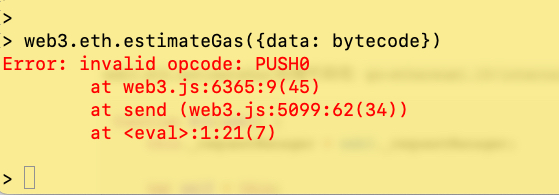
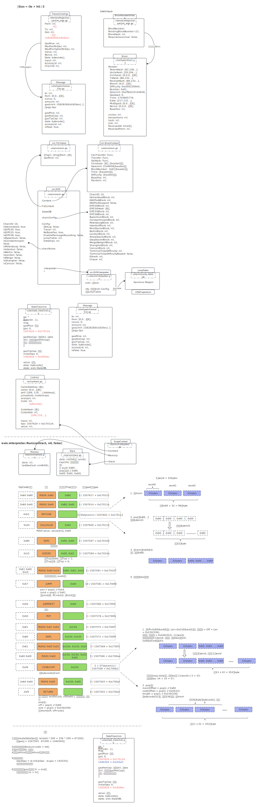
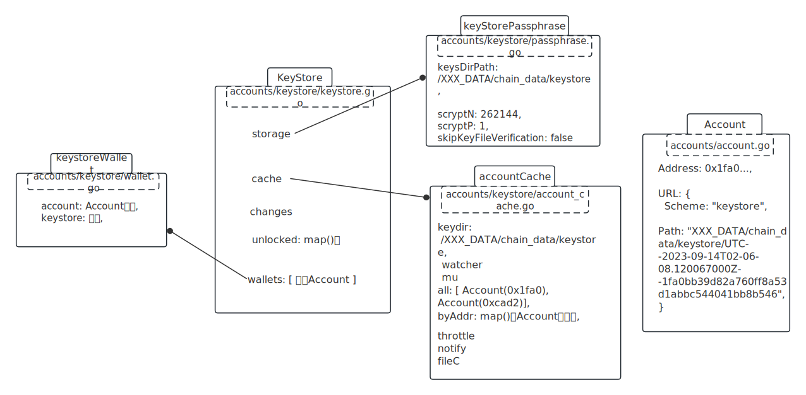
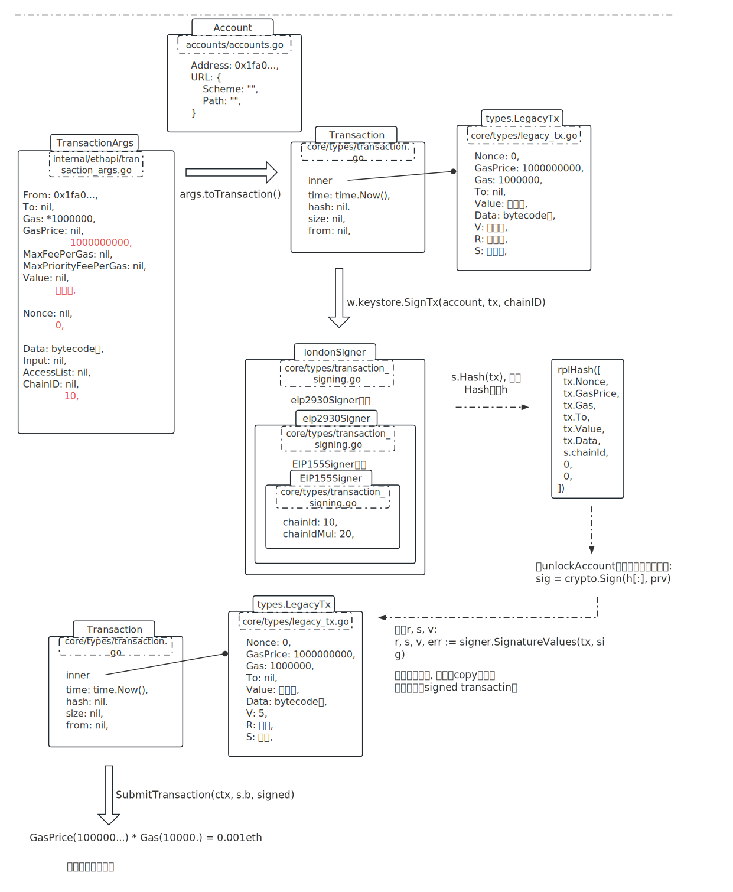

# remix上最简单的合约

```javascript
// SPDX-License-Identifier: GPL-3.0
pragma solidity >=0.8.2 <0.9.0;

contract Storage {

    uint256 number;
    function store(uint256 num) public {
        number = num;
    }
    function retrieve() public view returns (uint256){
        return number;
    }
}
```

<br />

编译出的bytecode：

```
608060405234801561000f575f80fd5b506101438061001d5f395ff3fe608060405234801561000f575f80fd5b5060043610610034575f3560e01c80632e64cec1146100385780636057361d14610056575b5f80fd5b610040610072565b60405161004d919061009b565b60405180910390f35b610070600480360381019061006b91906100e2565b61007a565b005b5f8054905090565b805f8190555050565b5f819050919050565b61009581610083565b82525050565b5f6020820190506100ae5f83018461008c565b92915050565b5f80fd5b6100c181610083565b81146100cb575f80fd5b50565b5f813590506100dc816100b8565b92915050565b5f602082840312156100f7576100f66100b4565b5b5f610104848285016100ce565b9150509291505056fea26469706673582212207ca8a77a375aff548bc76892f6b2093ea5bec72e34f6638bcd6bc43f620679bc64736f6c63430008160033
```

<br />

ABI：

```json
[
	{
		"inputs": [],
		"name": "retrieve",
		"outputs": [
			{
				"internalType": "uint256",
				"name": "",
				"type": "uint256"
			}
		],
		"stateMutability": "view",
		"type": "function"
	},
	{
		"inputs": [
			{
				"internalType": "uint256",
				"name": "num",
				"type": "uint256"
			}
		],
		"name": "store",
		"outputs": [],
		"stateMutability": "nonpayable",
		"type": "function"
	}
]
```

# Console发布合约

## 用abi创建合约工厂

```javascript
> abi = JSON.parse('[{"inputs":[],"name":"retrieve","outputs":[{"internalType":"uint256","name":"","type":"uint256"}],"stateMutability":"view","type":"function"},{"inputs":[{"internalType":"uint256","name":"num","type":"uint256"}],"name":"store","outputs":[],"stateMutability":"nonpayable","type":"function"}]')

> c = web3.eth.contract(abi)
```

<br />

`web3.eth.contract(abi)`后端代码在：`go-ethereum1.10/internal/jsre/deps/web3.js`

```javascript
Eth.prototype.contract = function (abi) {
    var factory = new Contract(this, abi);
    return factory;
};

// new Contract调用这里
var ContractFactory = function (eth, abi) {
    this.eth = eth;
    this.abi = abi;

    this.new = function () {
      // ...
    };
    this.new.getData = this.getData.bind(this);
};
```

可以看到，返回的是一个工厂对象，不是一个具体的合约对象。

<br />

## 用bytecode estimateGas

预估费用：

```javascript
> bytecode = '0x608060405234801561000f575f80fd5b506101438061001d5f395ff3fe608060405234801561000f575f80fd5b5060043610610034575f3560e01c80632e64cec1146100385780636057361d14610056575b5f80fd5b610040610072565b60405161004d919061009b565b60405180910390f35b610070600480360381019061006b91906100e2565b61007a565b005b5f8054905090565b805f8190555050565b5f819050919050565b61009581610083565b82525050565b5f6020820190506100ae5f83018461008c565b92915050565b5f80fd5b6100c181610083565b81146100cb575f80fd5b50565b5f813590506100dc816100b8565b92915050565b5f602082840312156100f7576100f66100b4565b5b5f610104848285016100ce565b9150509291505056fea26469706673582212207ca8a77a375aff548bc76892f6b2093ea5bec72e34f6638bcd6bc43f620679bc64736f6c63430008160033'

> web3.eth.estimateGas({data: bytecode})
```

用这个bytecode报错: invalid opcode: PUSH0：



<br />

解决: 

1、在Remix里compiler版本选0.8.18;

2、ENVIROMENT里选Remix VM(Merge);

```javascript
// 重新编译后得到正确的bytecode
> bytecode = '0x608060405234801561001057600080fd5b50610150806100206000396000f3fe608060405234801561001057600080fd5b50600436106100365760003560e01c80632e64cec11461003b5780636057361d14610059575b600080fd5b610043610075565b60405161005091906100a1565b60405180910390f35b610073600480360381019061006e91906100ed565b61007e565b005b60008054905090565b8060008190555050565b6000819050919050565b61009b81610088565b82525050565b60006020820190506100b66000830184610092565b92915050565b600080fd5b6100ca81610088565b81146100d557600080fd5b50565b6000813590506100e7816100c1565b92915050565b600060208284031215610103576101026100bc565b5b6000610111848285016100d8565b9150509291505056fea2646970667358221220322c78243e61b783558509c9cc22cb8493dde6925aa5e89a08cdf6e22f279ef164736f6c63430008120033'

> web3.eth.estimateGas({data: bytecode})
142525

```

`web3.eth.estimateGas`后端代码在: `go-ethereum1.10/internal/jsre/deps/web3.js`

```javascript
function Eth(web3) {
    this._requestManager = web3._requestManager;

    var self = this;

    methods().forEach(function(method) {
        method.attachToObject(self);
        method.setRequestManager(self._requestManager);
    });

    properties().forEach(function(p) {
        p.attachToObject(self);
        p.setRequestManager(self._requestManager);
    });
    this.iban = Iban;
    this.sendIBANTransaction = transfer.bind(null, this);
}
```

最终调用到的是`internal/ethapi/api.go`

```go
func (s *BlockChainAPI) EstimateGas(ctx context.Context, args TransactionArgs, blockNrOrHash *rpc.BlockNumberOrHash) (hexutil.Uint64, error) {
	bNrOrHash := rpc.BlockNumberOrHashWithNumber(rpc.PendingBlockNumber)
	if blockNrOrHash != nil {
		bNrOrHash = *blockNrOrHash
	}
	return DoEstimateGas(ctx, s.b, args, bNrOrHash, s.b.RPCGasCap())
}
```

<br />

**evm.interpreter.Run(contract, nil, false)**

取第0个字节（pc=0）0x60，在JumpTable里对应的是:

| index | 语义  | 详细operation                                                |
| ----- | ----- | ------------------------------------------------------------ |
| 0x60  | PUSH1 | execute: opPush1, constantGas: 3,<br />minStack: 0,  maxStack: 1023, |
|       |       |                                                              |

作如下处理：

1. contract.Gas = contract.Gas - 3, 减掉constantGas；
2. 判断有无dynamicGas；
3. 当前没有，执行PUSH1 0x80；此时栈：[ 0x80 ]；
4. PC指到2（bytecode的第三个字节），继续跑；

<br />

| OpCode/参数 | 语义            | 消耗gas/剩余gas                                              | 执行后栈(top在右边)          |
| ----------- | --------------- | ------------------------------------------------------------ | ---------------------------- |
| 0x60 0x80   | PUSH1 0x80      | 3 / 1507617 = 0x170121                                       | [ 0x80 ]                     |
| 0x60 0x40   | PUSH1 0x40      | 3 / 1507614 = 0x17011e                                       | [ 0x80, 0x40 ]               |
| 0x52        | MSTORE          | 3+9(dynamic) / 1507602 = 0x170112                            | []                           |
| 0x34        | CALLVALUE       | 2 / 1507600 = 0x170110                                       | [ 0x00 ]                     |
| 0x80        | DUP1            | 3 / 1507597 = 0x17010d                                       | [ 0x00, 0x00 ]               |
| 0x15        | ISZERO          | 3 / 1507594 = 0x17010a                                       | [ 0x00, 0x01 ]               |
| 0x61        | PUSH2 0x00 0x10 | 3 / 1507591 = 0x170107                                       | [ 0x00, 0x01, 0x10 ]         |
| 0x57        | JUMPI           | 10 / 1507581 = 0x1700fd                                      | [ 0x00 ]                     |
| 0x5b        | JUMPDEST        | 1 / 1507580 = 0x1700fc                                       | [ 0x00 ]                     |
| 0x50        | POP             | 2 / 1507578 = 0x1700fa                                       | [ ]                          |
| 0x61        | PUSH2 0x01 0x50 | 3 / 1507575 = 0x1700f7                                       | [ 0x150 ]                    |
| 0x80        | DUP1            | 3 / 1507572 = 0x1700f4                                       | [ 0x150, 0x150 ]             |
| 0x61        | PUSH2 0x00 0x20 | 3 / 1507569 = 0x1700f1                                       | [ 0x150, 0x150, 0x20 ]       |
| 0x60 0x00   | PUSH1 0x00      | 3 / 1507566 = 0x1700ee                                       | [ 0x150, 0x150, 0x20, 0x00 ] |
| 0x39        | CODECOPY        | 3 + 33(newTotalFee) - 9(last) + 33(copy data) = 57(dynamic) / 1507506 = 0x1700b2 | [ 0x150 ]                    |
| 0x60 0x00   | PUSH1 0x00      | 3 / 1507503 = 0x1700af                                       | [ 0x150, 0x00 ]              |
| 0xf3        | RETURN          | 0 / 1507503 = 0x1700af                                       | [ ]                          |
|             |                 | 总共消耗: 117                                                |                              |

```javascript
60 80 
60 40 
52
34
80
15
61 00 10 
57 // JUMPI 执行到这里, 跳到0x10处取
60 00 80 fd
5b // 从0x57跳过来
50
61 01 50
80
61 00 20
60 00
39 // CODECOPY 当前位置27
60 00 
f3 // RETURN 执行到这里, 返回下面336个字节
fe

// CODECOPY从这里取后面0x150(336)个字节到mem
608060405234801561001057600080fd5b50600436106100365760003560e01c80632e64cec11461003b5780636057361d14610059575b600080fd5b610043610075565b60405161005091906100a1565b60405180910390f35b610073600480360381019061006e91906100ed565b61007e565b005b60008054905090565b8060008190555050565b6000819050919050565b61009b81610088565b82525050565b60006020820190506100b66000830184610092565b92915050565b600080fd5b6100ca81610088565b81146100d557600080fd5b50565b6000813590506100e7816100c1565b92915050565b600060208284031215610103576101026100bc565b5b6000610111848285016100d8565b9150509291505056fea2646970667358221220322c78243e61b783558509c9cc22cb8493dde6925aa5e89a08cdf6e22f279ef164736f6c63430008120033
// 到这刚好336个字节

```

<br />

内存扩展Gas费用公式：
$$
LastGasCost_{初值} = 0
$$

$$
Fee = w^2 \div 512 + w \times3 - lastGasCost
$$

$$
lastGasCost = w^2\div512 + w\times3
$$


到此，Run在0xf3（RETURN）处跑完，返回 ret = mem[0, 0+336]；

<br />

**后续**

1、收一个createDataGas费用: len(ret) * 200 = 336 * 200 = 67200。此时gas值 = 1507503 - 67200 = 1440303；

2、设置合约地址对应的Account.code = ret；

3、gas值设置到st里; 

4、有一个refund过程，此时refund数量为0，略了；

5、得到执行结果：UsedGas = st.initialGas - st.gas = 142525；可是没用，到上层被丢弃掉了；

6、执行没报错，说明gas费足够，取 hi = mid；再从最开始执行；直到 lo > hi；

过程图示：



## 查看所有账户

```javascript
> > web3.eth.accounts
["0x1fa0bb39d82a760ff8a53d1abbc544041bb8b546", "0xcad234afd3b0a96c8f25cb5de9da3e243d063429"]
```


## 查看账户钱

```javascript
> web3.eth.getBalance(eth.coinbase)
1000000
```


## unlock账户

```javascript
> personal.unlockAccount(eth.coinbase)
// 或者直接传密码, 存活3600s
> personal.unlockAccount(eth.coinbase, "123456", 3600)
```

web3.js代码就不看，直接看Go代码，通过查找[inprocHandler](./X_06_inprocHandler.md)，unlockAccount在 `internal/ethapi/api.go#PersonalAccountAPI{}`，打上断点。

```go
func (s *PersonalAccountAPI) UnlockAccount(ctx context.Context, addr common.Address, password string, duration *uint64) (bool, error) {
  ...
}
```

再调用`func (ks keyStorePassphrase) GetKey(addr common.Address, filename, auth string)`方法，方法作的事如下：

1、读取"XXX_DATA/chain_data/keystore/UTC--2023-09-14T02-06-08.120067000Z--1fa0bb39d82a760ff8a53d1abbc544041bb8b546" 文件内容。并json.Unmarshal成结构体：`encryptedKeyJSONV3`

```json
{
  "address":"1fa0bb39d82a760ff8a53d1abbc544041bb8b546",
  "crypto":{
    "cipher":"aes-128-ctr",
    "ciphertext":"9597a1213af29238d3db7ff0155f220d8d1500be4cfa773a8d66ec1c5de113a6",
    "cipherparams":{
      "iv":"a7a244997899838d601a787587a1379a"
    },
    "kdf":"scrypt",
    "kdfparams":{
      "dklen":32,
      "n":262144,
      "p":1,
      "r":8,
      "salt":"42ddc8ce3f1780a14bd666b915c3bafd865f011d0301a59ba7a425d65d6a114a"
    },
    "mac":"958bde58d4ce87c1d3e0a762ac0c28434f01f50c54edc2a809d0042f63e93c4b"
  },
  "id":"e289cb75-7fd5-4dc0-adc7-c680db044084",
  "version":3
}

```

2、拿到KDF：`func getKDFKey(cryptoJSON CryptoJSON, auth string) ([]byte, error)`

即返回scrypt.Key(salt、n、r、p、dklen、auth(密码123456) )，得到一个32个byte的切片derivedKey。

3、取切片的后16个byte，与ciphertext作keccak256：crypto.Keccak256(derivedKey[16:32], cipherText)。

4、判断是否跟mac相等。

5、  再写aes：plainText, err := aesCTRXOR(derivedKey[:16], cipherText, iv)。

验证无误，解锁。默认5分钟有效。类图如下：



## 部署合约

```javascript
> cInstance = c.new({data: bytecode, gas: 200000, gasPrice: 1, from: eth.coinbase}, function(e, contract){
  if(!e){
    if(!contract.address){
      console.log("Contract transaction send: Transaction Hash: "+contract.transactionHash+" waiting to be mined...");
    }else{
      console.log("Contract mined! Address: "+contract.address);
      console.log(contract);
    }
  }else{
    console.log(e)
  }
})
```

此时，报错：Error: authentication needed: password or unlock。

所以，部署前要先unlock。

web3.js代码在：`internal/jsre/deps/web3.js`

```javascript
var ContractFactory = function (eth, abi) {
  this.eth = eth;
  this.abi = abi;
  this.new = function () {
    ...
    // 最终调用的是这个
    this.eth.sendTransaction(...)
  }
};
```

Go代码在：internal/ethapi/api.go

```go
func (s *TransactionAPI) SendTransaction(ctx context.Context, args TransactionArgs) (common.Hash, error) {
  ...
}
```

大致过程如图：



入交易池部分在[tx_pool文档](./X_12_txpool.md)里。

<br />

## 挖矿

```javascript
> miner.start(1)
```

能否能挖新新区，取决于交易池是否有交易和服务器性能。


# 各个JumpTable


Frontier JumpTable

| 语义                   | index | 详细operation                                                | 解释                                                         |
| ---------------------- | ----- | ------------------------------------------------------------ | ------------------------------------------------------------ |
| STOP                   | 0x00  | execute: opStop, constantGas: 0,<br />minStack: 0,  maxStack: 0, |                                                              |
| ADD                    | 0x01  | execute: opAdd, constantGas: 3,<br />minStack: 2,  maxStack: 1025, |                                                              |
| MUL                    | 0x02  | execute: opMul, constantGas: 5,<br />minStack: 2,  maxStack: 1025, |                                                              |
| SUB                    | 0x03  | execute: opSub, constantGas: 3,<br />minStack: 2,  maxStack: 1025, |                                                              |
| DIV                    | 0x04  | execute: opDiv, constantGas: 5,<br />minStack: 2,  maxStack: 1025, |                                                              |
| SDIV                   | 0x05  | execute: opSdiv, constantGas: 5,<br />minStack: 2,  maxStack: 1025, |                                                              |
| MOD                    | 0x06  | execute: opMod, constantGas: 5,<br />minStack: 2,  maxStack: 1025, |                                                              |
| SMOD                   | 0x07  | execute: opSmod, constantGas: 5,<br />minStack: 2,  maxStack: 1025, |                                                              |
| ADDMOD                 | 0x08  | execute: opAddmod, constantGas: 8,<br />minStack: 3,  maxStack: 1026, |                                                              |
| MULMOD                 | 0x09  | execute: opMulmod, constantGas: 8,<br />minStack: 3,  maxStack: 1026, |                                                              |
| EXP                    | 0xa   | execute: opExp, <br />dynamicGas: gasExpFrontier,<br />minStack: 2,  maxStack: 1025, |                                                              |
| SIGNEXTEND             | 0xb   | execute: opSignExtend, constantGas: 5,<br />minStack: 2,  maxStack: 1025, |                                                              |
|                        |       |                                                              |                                                              |
| LT                     | 0x10  | execute: opLt, constantGas: 3,<br />minStack: 2,  maxStack: 1025, |                                                              |
| GT                     | 0x11  | execute: opGt, constantGas: 3,<br />minStack: 2,  maxStack: 1025, |                                                              |
| SLT                    | 0x12  | execute: opSlt, constantGas: 3,<br />minStack: 2,  maxStack: 1025, |                                                              |
| SGT                    | 0x13  | execute: opSgt, constantGas: 3,<br />minStack: 2,  maxStack: 1025, |                                                              |
| EQ                     | 0x14  | execute: opEq, constantGas: 3,<br />minStack: 2,  maxStack: 1025, |                                                              |
| ISZERO                 | 0x15  | execute: opIszero, constantGas: 3,<br />minStack: 1,  maxStack: 1024, | 如果Top是0x00, 则改Top = 1;<br />如果Top是非0, 则改Top = 0;  |
| AND                    | 0x16  | execute: opAnd, constantGas: 3,<br />minStack: 2,  maxStack: 1025, |                                                              |
| OR                     | 0x17  | execute: opOr, constantGas: 3,<br />minStack: 2,  maxStack: 1025, |                                                              |
| XOR                    | 0x18  | execute: opXor, constantGas: 3,<br />minStack: 2,  maxStack: 1025, |                                                              |
| NOT                    | 0x19  | execute: opNot, constantGas: 3,<br />minStack: 1,  maxStack: 1024, |                                                              |
| BYTE                   | 0x1a  | execute: opByte, constantGas: 3,<br />minStack: 2,  maxStack: 1025, |                                                              |
|                        |       |                                                              |                                                              |
| KECCAK256              | 0x20  | execute: opKeccak256, <br />constantGas: 30,<br />dynamicGas: gasKeccak256,<br />minStack: 2,  maxStack: 1025,<br/>memorySize: memoryKeccak256(Func), |                                                              |
|                        |       |                                                              |                                                              |
| ADDRESS                | 0x30  | execute: opAddress, constantGas: 2,<br />minStack: 0,  maxStack: 1023, |                                                              |
| BALANCE                | 0x31  | execute: opBalance, constantGas: 20,<br />minStack: 1,  maxStack: 1024, |                                                              |
| ORIGIN                 | 0x32  | execute: opOrigin, constantGas: 2,<br />minStack: 0,  maxStack: 1023, |                                                              |
| CALLER                 | 0x33  | execute: opCaller, constantGas: 2,<br />minStack: 0,  maxStack: 1023, |                                                              |
| CALLVALUE              | 0x34  | execute: opCallValue, constantGas: 2,<br />minStack: 0,  maxStack: 1023, | PUSH value                                                   |
| CALLDATALOAD           | 0x35  | execute: opCallDataLoad, <br />constantGas: 3,<br />minStack: 1,  maxStack: 1024, |                                                              |
| CALLDATASIZE           | 0x36  | execute: opCallDataSize,<br />constantGas: 2,<br />minStack: 0,  maxStack: 1023, |                                                              |
| CALLDATACOPY           | 0x37  | execute: opCallDataCopy, <br />constantGas: 3,<br />dynamicGas: gasCallDataCopy,<br />minStack: 3,  maxStack: 1027,<br/>memorySize: memoryCallDataCopy(Func), |                                                              |
| CODESIZE               | 0x38  | execute: opCodeSize, constantGas: 2,<br />minStack: 0,  maxStack: 1023, |                                                              |
| CODECOPY               | 0x39  | execute: opCodeCopy, <br />constantGas: 3,<br />dynamicGas: gasCodeCopy,<br />minStack: 3,  maxStack: 1027,<br/>memorySize: memoryCodeCopy(Func), | [... 2, 1, 0 ]<br />取0为Off, 2为Len,<br />扩展内存          |
| GASPRICE               | 0x3a  | execute: opGasprice, constantGas: 2,<br />minStack: 0,  maxStack: 1023, |                                                              |
| EXTCODESIZE            | 0x3b  | execute: opExtCodeSize, constantGas: 20,<br />minStack: 1,  maxStack: 1024, |                                                              |
| EXTCODECOPY            | 0x3c  | execute: opExtCodeCopy, <br />constantGas: 20,<br />dynamicGas: gasExtCodeCopy,<br />minStack: 4,  maxStack: 1028,<br/>memorySize: memoryExtCodeCopy(Func), |                                                              |
|                        |       |                                                              |                                                              |
| BLOCKHASH              | 0x40  | execute: opBlockhash, constantGas: 20,<br />minStack: 1,  maxStack: 1024, |                                                              |
| COINBASE               | 0x41  | execute: opCoinbase, constantGas: 2,<br />minStack: 0,  maxStack: 1023, |                                                              |
| TIMESTAMP              | 0x42  | execute: opTimestamp, constantGas: 2,<br />minStack: 0,  maxStack: 1023, |                                                              |
| NUMBER                 | 0x43  | execute: opNumber, constantGas: 2,<br />minStack: 0,  maxStack: 1023, |                                                              |
| DIFFICULTY<br />RANDOM | 0x44  | execute: opDifficulty, constantGas: 2,<br />minStack: 0,  maxStack: 1023, |                                                              |
| GASLIMIT               | 0x45  | execute: opGasLimit, constantGas: 2,<br />minStack: 0,  maxStack: 1023, |                                                              |
|                        |       |                                                              |                                                              |
| POP                    | 0x50  | execute: opPop, constantGas: 2,<br />minStack: 1,  maxStack: 1025, | pop出Top                                                     |
| MLOAD                  | 0x51  | execute: opMload, <br />constantGas: 3,<br />dynamicGas: gasMLoad,<br />minStack: 1,  maxStack: 1024,<br/>memorySize: memoryMLoad(Func), |                                                              |
| MSTORE                 | 0x52  | execute: opMstore, <br />constantGas: 3,<br />dynamicGas: gasMStore,<br />minStack: 2,  maxStack: 1026,<br/>memorySize: memoryMStore(Func), | pop两次,<br />拿到mStart, val,<br />w为字,<br />计算Fee=F(w)=$w^2$$\div$512 + w$\times$3 - F(w -1) |
| MSTORE8                | 0x53  | execute: opMstore8, <br />constantGas: 3,<br />dynamicGas: gasMStore8,<br />minStack: 2,  maxStack: 1026,<br/>memorySize: memoryMStore8(Func), |                                                              |
| SLOAD                  | 0x54  | execute: opSload, constantGas: 50,<br />minStack: 1,  maxStack: 1024, |                                                              |
| SSTORE                 | 0x55  | execute: opSstore,<br />dynamicGas: gasSStore,<br />minStack: 2,  maxStack: 1026, |                                                              |
| JUMP                   | 0x56  | execute: opJump, constantGas: 50,<br />minStack: 1,  maxStack: 1024, |                                                              |
| JUMPI                  | 0x57  | execute: opJumpi, constantGas: 10,<br />minStack: 2,  maxStack: 1026, | pos = pop();<br />cond = pop():<br />如果cond非0, 跳到pos取指 |
| PC                     | 0x58  | execute: opPc, constantGas: 2,<br />minStack: 0,  maxStack: 1023, |                                                              |
| MSIZE                  | 0x59  | execute: opMsize, constantGas: 2,<br />minStack: 0,  maxStack: 1023, |                                                              |
| GAS                    | 0x5a  | execute: opGas, constantGas: 2,<br />minStack: 0,  maxStack: 1023, |                                                              |
| JUMPDEST               | 0x5b  | execute: opJumpdest, constantGas: 1,<br />minStack: 0,  maxStack: 1024, | 什么也不做                                                   |
|                        |       |                                                              |                                                              |
| PUSH1                  | 0x60  | execute: opPush1, constantGas: 3,<br />minStack: 0,  maxStack: 1023, |                                                              |
| PUSH2                  | 0x61  | execute: makePush(2, 2),<br />constantGas: 3,<br />minStack: 0,  maxStack: 1023, | 大端连接后面两个字节, push进入                               |
| 一直到32               | ...   |                                                              |                                                              |
| PUSH32                 | 0x7f  | execute: makePush(32, 32),<br />constantGas: 3,<br />minStack: 0,  maxStack: 1023, |                                                              |
|                        |       |                                                              |                                                              |
| DUP1                   | 0x80  | execute: makeDup(1),<br />constantGas: 3,<br />minStack: 1,  maxStack: 1023, | 复制一份栈顶                                                 |
| 一直到16               | ...   |                                                              |                                                              |
| DUP16                  | 0x8f  | execute: makeDup(16),<br />constantGas: 3,<br />minStack: 16,  maxStack: 1023, |                                                              |
|                        |       |                                                              |                                                              |
| SWAP1                  | 0x90  | execute: makeSwap(1),<br />constantGas: 3,<br />minStack: 2,  maxStack: 1024, |                                                              |
| 一直到16               | ...   |                                                              |                                                              |
| SWAP16                 | 0x9f  | execute: makeSwap(16),<br />constantGas: 3,<br />minStack: 17,  maxStack: 1024, |                                                              |
|                        |       |                                                              |                                                              |
| LOG0                   | 0xa0  | execute: makeLog(0), <br />dynamicGas: makeGasLog(0),<br />minStack: 2,  maxStack: 1026,<br/>memorySize: memoryLog(Func), |                                                              |
| LOG1                   | 0xa1  | execute: makeLog(1), <br />dynamicGas: makeGasLog(1),<br />minStack: 3,  maxStack: 1027,<br/>memorySize: memoryLog(Func), |                                                              |
| LOG2                   | 0xa2  | execute: makeLog(2), <br />dynamicGas: makeGasLog(2),<br />minStack: 4,  maxStack: 1028,<br/>memorySize: memoryLog(Func), |                                                              |
| LOG3                   | 0xa3  | execute: makeLog(3), <br />dynamicGas: makeGasLog(3),<br />minStack: 5,  maxStack: 1029,<br/>memorySize: memoryLog(Func), |                                                              |
| LOG4                   | 0xa4  | execute: makeLog(4), <br />dynamicGas: makeGasLog(4),<br />minStack: 6,  maxStack: 1030,<br/>memorySize: memoryLog(Func), |                                                              |
|                        |       |                                                              |                                                              |
| CREATE                 | 0xf0  | execute: opCreate,<br />constantGas: 32000,<br />dynamicGas: gasCreate,<br />minStack: 3,  maxStack: 1026,<br/>memorySize: memoryCreate(Func), |                                                              |
| CALL                   | 0xf1  | execute: opCall,<br />constantGas: 40,<br />dynamicGas: gasCall,<br />minStack: 7,  maxStack: 1030,<br/>memorySize: memoryCall(Func), |                                                              |
| CALLCODE               | 0xf2  | execute: opCallCode,<br />constantGas: 40,<br />dynamicGas: gasCallCode,<br />minStack: 7,  maxStack: 1030,<br/>memorySize: memoryCall(Func), |                                                              |
| RETURN                 | 0xf3  | execute: opReturn,<br />dynamicGas: gasReturn,<br />minStack: 2,  maxStack: 1026,<br/>memorySize: memoryReturn(Func), | [ off, len ]<br />看是否需要扩展内存;<br />pop两次:off, size;<br />返回mem[off, off+size] |
| SELFDESTRUCT           | 0xff  | execute: opSelfdestruct,<br />dynamicGas: gasSelfdestruct,<br />minStack: 1,  maxStack: 1025, |                                                              |
|                        |       |                                                              |                                                              |

<br />

Homestead JumpTable

在Frontier基础上，增加:

| index | 语义         | 详细operation                                                |
| ----- | ------------ | ------------------------------------------------------------ |
| 0xf4  | DELEGATECALL | execute: opDelegateCall,<br />constantGas: 40,<br />dynamicGas: gasDelegateCall,<br />minStack: 6,  maxStack: 1029,<br/>memorySize: memoryDelegateCall, |
|       |              |                                                              |

<br />

Tangerine Whistle（EIP 150） JumpTable

在Homestead基础上，修改:

| index | 语义         | 详细operation                                                |
| ----- | ------------ | ------------------------------------------------------------ |
| 0x31  | BALANCE      | execute: opBalance,<br /><font color='red'>constantGas: 20 -> 400,</font><br />minStack: 1,  maxStack: 1024, |
| 0x3b  | EXTCODESIZE  | execute: opExtCodeSize,<br /><font color='red'>constantGas: 20 -> 700,</font><br />minStack: 1,  maxStack: 1024, |
| 0x54  | SLOAD        | execute: opSload,<br /><font color='red'>constantGas: 50 -> 200,</font><br />minStack: 1,  maxStack: 1024, |
| 0x3c  | EXTCODECOPY  | execute: opExtCodeCopy, <br /><font color='red'>constantGas: 20 -> 700,</font><br />dynamicGas: gasExtCodeCopy,<br />minStack: 4,  maxStack: 1028,<br/>memorySize: memoryExtCodeCopy, |
| 0xf1  | CALL         | execute: opCall,<br /><font color='red'>constantGas: 40 -> 700,</font><br />dynamicGas: gasCall,<br />minStack: 7,  maxStack: 1030,<br/>memorySize: memoryCall, |
| 0xf2  | CALLCODE     | execute: opCallCode,<br /><font color='red'>constantGas: 40 -> 700,</font><br />dynamicGas: gasCallCode,<br />minStack: 7,  maxStack: 1030,<br/>memorySize: memoryCall, |
| 0xf4  | DELEGATECALL | execute: opDelegateCall,<br /><font color='red'>constantGas: 40 -> 700,</font><br />dynamicGas: gasDelegateCall,<br />minStack: 6,  maxStack: 1029,<br/>memorySize: memoryDelegateCall, |
|       |              |                                                              |

<br />

Spurious Dragon（EIP 158）JumpTable

在Tangerine Whistle的基础上，修改:

| index | 语义 | 详细operation                                                |
| ----- | ---- | ------------------------------------------------------------ |
| 0xa   | EXP  | execute: opExp, <br /><font color='red'>dynamicGas: gasExpFrontier -> gasExpEIP158,</font><br />minStack: 2,  maxStack: 1025, |
|       |      |                                                              |


