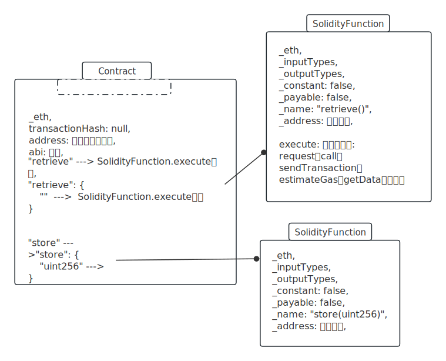
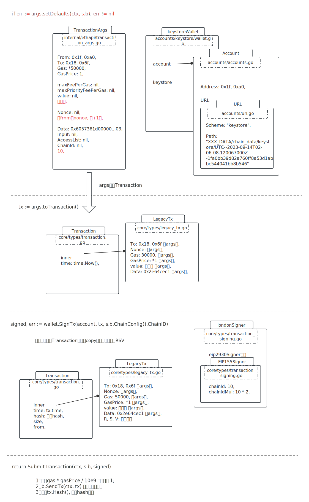
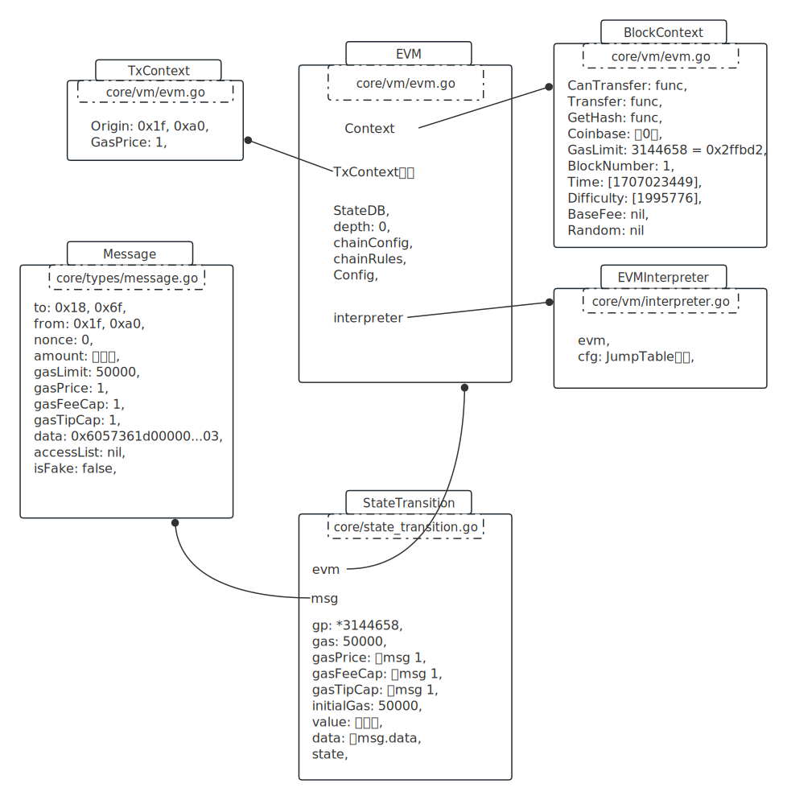

经过[solidity_01](./X_solidity_01_estimageGas.md)文档，部署了合约、开启了挖矿。部署返回的结果：

```javascript
Contract transaction send: Transaction Hash: 0xb4f7c29a617c6e03d40f4e8d9f5e99b01e123c46142b24812f608f6f8d97f93c waiting to be mined...
{
  abi: [{
      inputs: [],
      name: "retrieve",
      outputs: [{...}],
      stateMutability: "view",
      type: "function"
  }, {
      inputs: [{...}],
      name: "store",
      outputs: [],
      stateMutability: "nonpayable",
      type: "function"
  }],
  address: undefined,
  transactionHash: "0xb4f7c29a617c6e03d40f4e8d9f5e99b01e123c46142b24812f608f6f8d97f93c"
}

```

接下来看调用合约过程。


# web3版本

console内置的web3版本比较老，现在2024/2/3了，官网都1.2.0 --- 1.10.0了，有的API不兼容了。

console内置的web3版本：

```javascript
> web3.version
{
  api: "0.20.1",
  ethereum: undefined,
  network: "1",
  node: "Geth/v1.10.26-stable/darwin-amd64/go1.20.3",
  whisper: undefined,
  getEthereum: function(callback),
  getNetwork: function(callback),
  getNode: function(callback),
  getWhisper: function(callback)
}

```

找到个0.20.7的文档：https://github.com/web3/web3.js/blob/0.20.7/DOCUMENTATION.md


# 找到合约地址

## 根据tx hash获取详情

```javascript
> 
 web3.eth.getTransaction('0xb4f7c29a617c6e03d40f4e8d9f5e99b01e123c46142b24812f608f6f8d97f93c')

// 结果:
{
  blockHash: "0x29d3d8276a88532aa79d1d763b5140233eda4fd7ae5bab7aeb190aa022a2291b",
  blockNumber: 1,
  chainId: "0xa",
  from: "0x1fa0bb39d82a760ff8a53d1abbc544041bb8b546",
  gas: 200000,
  gasPrice: 1,
  hash: "0xb4f7c29a617c6e03d40f4e8d9f5e99b01e123c46142b24812f608f6f8d97f93c",
  input: "0x608060405234801561001057600080fd5b50610150806100206000396000f3fe608060405234801561001057600080fd5b50600436106100365760003560e01c80632e64cec11461003b5780636057361d14610059575b600080fd5b610043610075565b60405161005091906100a1565b60405180910390f35b610073600480360381019061006e91906100ed565b61007e565b005b60008054905090565b8060008190555050565b6000819050919050565b61009b81610088565b82525050565b60006020820190506100b66000830184610092565b92915050565b600080fd5b6100ca81610088565b81146100d557600080fd5b50565b6000813590506100e7816100c1565b92915050565b600060208284031215610103576101026100bc565b5b6000610111848285016100d8565b9150509291505056fea2646970667358221220322c78243e61b783558509c9cc22cb8493dde6925aa5e89a08cdf6e22f279ef164736f6c63430008120033",
  nonce: 0,
  r: "0x6c9ad12bcb5d4794fb755b38259be8e7dad6e920d87ad90d0d5e08bbecf9f7b7",
  s: "0x365955e916e8ab3bf89753f96164608f710f8a91c0001edad6fb5ea69f9b4327",
  to: null,
  transactionIndex: 0,
  type: "0x0",
  v: "0x38",
  value: 0
}

```

看来这里没有合约地址。

## 根据tx hash获取receipt

```javascript
> web3.eth.getTransactionReceipt('0xb4f7c29a617c6e03d40f4e8d9f5e99b01e123c46142b24812f608f6f8d97f93c')
{
  blockHash: "0x29d3d8276a88532aa79d1d763b5140233eda4fd7ae5bab7aeb190aa022a2291b",
  blockNumber: 1,
  contractAddress: "0x186f7bc3a3151bdd8b2280502de448d11a2c3fc0",
  cumulativeGasUsed: 142525,
  effectiveGasPrice: 1,
  from: "0x1fa0bb39d82a760ff8a53d1abbc544041bb8b546",
  gasUsed: 142525,
  logs: [],
  logsBloom: "0x00000000000000000000000000000000000000000000000000000000000000000000000000000000000000000000000000000000000000000000000000000000000000000000000000000000000000000000000000000000000000000000000000000000000000000000000000000000000000000000000000000000000000000000000000000000000000000000000000000000000000000000000000000000000000000000000000000000000000000000000000000000000000000000000000000000000000000000000000000000000000000000000000000000000000000000000000000000000000000000000000000000000000000000000000000000",
  root: "0x26af651051ca86e8857e6e3f11fefbcac6c8a0d47b7f7f8550e20678bd36e6bf",
  to: null,
  transactionHash: "0xb4f7c29a617c6e03d40f4e8d9f5e99b01e123c46142b24812f608f6f8d97f93c",
  transactionIndex: 0,
  type: "0x0"
}

```

拿到了合约地址：`0x186f7bc3a3151bdd8b2280502de448d11a2c3fc0`。

## 或者直接用cInstance

```javascript
> cInstance
{
  abi: [{
      inputs: [],
      name: "retrieve",
      outputs: [{...}],
      stateMutability: "view",
      type: "function"
  }, {
      inputs: [{...}],
      name: "store",
      outputs: [],
      stateMutability: "nonpayable",
      type: "function"
  }],
  address: "0x186f7bc3a3151bdd8b2280502de448d11a2c3fc0",
  transactionHash: "0xb4f7c29a617c6e03d40f4e8d9f5e99b01e123c46142b24812f608f6f8d97f93c",
  allEvents: function bound(),
  retrieve: function bound(),
  store: function bound()
}
```

# 实例化一个合约对象

根据abi、合约地址

```javascript
> myContractInstance = c.at('0x186f7bc3a3151bdd8b2280502de448d11a2c3fc0');
```

web3.js对应的代码：

```javascript
/**
 * Should be called to get access to existing contract on a blockchain
 *
 * @method at
 * @param {Address} contract address (required)
 * @param {Function} callback {optional)
 * @returns {Contract} returns contract if no callback was passed,
 * otherwise calls callback function (err, contract)
 */
ContractFactory.prototype.at = function (address, callback) {
    var contract = new Contract(this.eth, this.abi, address);

    // this functions are not part of prototype,
    // because we don't want to spoil the interface
    addFunctionsToContract(contract);
    addEventsToContract(contract);

    if (callback) {
        callback(null, contract);
    }
    return contract;
};
```

类图示意如下：



# 调用view函数

## 调用报错

```javascript
> myContractInstance.retrieve()
Error: invalid address
	at inputAddressFormatter (web3.js:3940:11(45))
	at inputTransactionFormatter (web3.js:3756:41(14))
  ...
> 
```

报错了，怎么肥事？

经查一翻代码，发现是from参数是空的，也从文档里找到这样的描述：

> ```
> web3.eth.defaultAccount
> This default address is used for the following methods (optionally you can overwrite it by specifying the from property):
> 
> web3.eth.sendTransaction()
> web3.eth.call()
> ```

看一下果然没设置：

```javascript
> web3.eth.defaultAccount
undefined
> 
```

设置一下值：

```javascript
web3.eth.defaultAccount = '0x1fa0bb39d82a760ff8a53d1abbc544041bb8b546';
```

再调一下：

```javascript
> myContractInstance.retrieve()
Error: invalid opcode: SHR
	at web3.js:6365:9(45)
	at send (web3.js:5099:62(34))
	at web3.js:4155:41(50)
	at apply 
```

又报错，这个是解析opcode时报错了，看Go部分代码。

根据web3.js的代码，调用有`eth_call`、`eth_sendTransaction`两种。`eth_call`是`constant`属性为`true`时的调用。

根据[inprocHandler文档](./X_06_inprocHandler.md)，eth_sendTransaction的Go代码在：

```go
// internal/ethapi/api.go

func (s *TransactionAPI) SendTransaction(ctx context.Context, args TransactionArgs) (common.Hash, error) {
	// Look up the wallet containing the requested signer
	account := accounts.Account{Address: args.from()}

	wallet, err := s.b.AccountManager().Find(account)
	if err != nil {
		return common.Hash{}, err
	}

	if args.Nonce == nil {
		s.nonceLock.LockAddr(args.from())
		defer s.nonceLock.UnlockAddr(args.from())
	}

	if err := args.setDefaults(ctx, s.b); err != nil {
		return common.Hash{}, err
	}

	tx := args.toTransaction()

	signed, err := wallet.SignTx(account, tx, s.b.ChainConfig().ChainID)
	if err != nil {
		return common.Hash{}, err
	}
	return SubmitTransaction(ctx, s.b, signed)
}
```

打上断点，进入调试。

## 调试过程

刚打调试，又报了个别的错：

```javascript
> myContractInstance.retrieve()
Error: gas required exceeds allowance (0)
	at web3.js:6365:9(45)
	at send (web3.js:5099:62(34))
```

经过一番源码走查，因为没有提供Gas，默认的gasPrice: 1000000000（GWei = 1e9），

当前from的balance: 1000000 wei，转成allowance = 1000000 / 1000000000 = 0GWei，

非合约创建的gas基础费用：params.TxGas(21000) + NZ = 21272，

allowance < 21272，所以报错了。

解决办法：

调用的时候直接提供一个Gas试试：

```
> myContractInstance.retrieve({gas: 30000})
```

又报错：

```javascript
> myContractInstance.retrieve({gas: 30000})
Error: authentication needed: password or unlock
	at web3.js:6365:9(45)
```

先unlock吧：

```javascript
> personal.unlockAccount(eth.coinbase, "123456", 36000)
```

继续，又报错：

```javascript
> myContractInstance.retrieve({gas: 30000})
Error: insufficient funds for gas * price + value
	at web3.js:6365:9(45)

```

不用看，gasPrice太大了，再加一个：

```javascript
> myContractInstance.retrieve({gas: 30000, gasPrice: 1})
"0xfde4950177b73092ddee3c621ed121242b32fe92eddab7ebd282d2a538f24bc3"
> 

```

这次可以了。

## 结果分析

.svg)

原来返回的是交易hash值。那怎么取得结果呢？

看一下交易详情：

```javascript
> web3.eth.getTransaction('0x6961d171d2c9c1afa35b3707906044ff2264ba45b414e7d2a18fa8d8aff1b746')
{
  blockHash: null,
  blockNumber: null,
  chainId: "0xa",
  from: "0x1fa0bb39d82a760ff8a53d1abbc544041bb8b546",
  gas: 30000,
  gasPrice: 1,
  hash: "0x6961d171d2c9c1afa35b3707906044ff2264ba45b414e7d2a18fa8d8aff1b746",
  input: "0x2e64cec1",
  nonce: 1,
  r: "0x8240db3e9aedd2ea789b9fe48354842b55f68d2c0dc3bf98e3e44cd15173ff22",
  s: "0x263f861ec3e89d0634d44714f218cb0543f0d6c15ba7f427753228bfc756de18",
  to: "0x186f7bc3a3151bdd8b2280502de448d11a2c3fc0",
  transactionIndex: null,
  type: "0x0",
  v: "0x38",
  value: 0
}

```

再看一下收据有没有：

```javascript
> web3.eth.getTransactionReceipt('0x6961d171d2c9c1afa35b3707906044ff2264ba45b414e7d2a18fa8d8aff1b746')
null
```

没有，应该是因为没有开启miner。开一下miner.start()。

等一会，就有了：

```javascript
> web3.eth.getTransactionReceipt('0x6961d171d2c9c1afa35b3707906044ff2264ba45b414e7d2a18fa8d8aff1b746')
{
  blockHash: "0x19b2d93bdcb260d5f7b0c9c6289f23111461c9fe4f39eca58872b9192f343bfc",
  blockNumber: 1,
  contractAddress: null,
  cumulativeGasUsed: 42544,
  effectiveGasPrice: 1,
  from: "0x1fa0bb39d82a760ff8a53d1abbc544041bb8b546",
  gasUsed: 21272,
  logs: [],
  logsBloom: "0x00000000000000000000000000000000000000000000000000000000000000000000000000000000000000000000000000000000000000000000000000000000000000000000000000000000000000000000000000000000000000000000000000000000000000000000000000000000000000000000000000000000000000000000000000000000000000000000000000000000000000000000000000000000000000000000000000000000000000000000000000000000000000000000000000000000000000000000000000000000000000000000000000000000000000000000000000000000000000000000000000000000000000000000000000000000",
  root: "0xf0987ae9c471153c0b4bec8339df28d9a3ccb600c8df894073e266ff261cc19c",
  to: "0x186f7bc3a3151bdd8b2280502de448d11a2c3fc0",
  transactionHash: "0x6961d171d2c9c1afa35b3707906044ff2264ba45b414e7d2a18fa8d8aff1b746",
  transactionIndex: 1,
  type: "0x0"
}
> 
```

可是还是没有output，在哪呢？

查了一翻资料，`eth_sendTransaction`拿不到返回值，除非用事件的方式的。

我是用新版的remix编译出来的abi，函数没有`constant`属性了，而本地的web3.js是老版本，根据函数`constant`属性来决定是调用`eth_sendTransaction`还是`eth_call`，可知一律都是调`eth_sendTransaction`了。

所有得手动改用`eth_call`的方式来调用。

## 改用call调用

```javascript
> myContractInstance.retrieve.call({gas: 30000, gasPrice: 1})
0
> myContractInstance.retrieve.call()
0
```

又没报错了。。

> 后面的断点调试过程中，发现停留时间太久，报出这个错误了：
>
> ```javascript
> > myContractInstance.retrieve.call()
> Error: execution aborted (timeout = 5s)
> 	at web3.js:6365:9(45)
> 	at send (web3.js:5099:62(34))
> 	at web3.js:4120:36(43)
> ```
>
> 可以在启动geth的时候，指定不启用默认超时：
>
> --rpc.evmtimeout 0

对应的Go代码：

```go
func (s *BlockChainAPI) Call(ctx context.Context, args TransactionArgs, blockNrOrHash rpc.BlockNumberOrHash, overrides *StateOverride) (hexutil.Bytes, error) {
  result, err := DoCall(
    ctx, 
    s.b, 
    args, 
    blockNrOrHash, 
    overrides, 
    s.b.RPCEVMTimeout(), 
    s.b.RPCGasCap(),
  )
	return result.Return(), result.Err
}
```

最后调用的是：

```go
func (st *StateTransition) TransitionDb() (*ExecutionResult, error) {
  
  var (
    msg              = st.msg
    sender           = vm.AccountRef(msg.From())
	)
  // 基础费用 = 21272
  gas, err := IntrinsicGas(
    st.data, 
    st.msg.AccessList(), 
    contractCreation, 
    rules.IsHomestead, 
    rules.IsIstanbul
  ),
  if st.gas < gas {
    return nil, fmt.Errorf("%w: have %d, want %d", ErrIntrinsicGas, st.gas, gas)
  }
  st.gas -= gas

  var (
    ret   []byte
    vmerr error // vm errors do not effect consensus and are therefore not assigned to err
	)
  if contractCreation {
    ret, _, st.gas, vmerr = st.evm.Create(sender, st.data, st.gas, st.value)
  } else {
    st.state.SetNonce(msg.From(), st.state.GetNonce(sender.Address())+1)
    // 执行st.data
    ret, st.gas, vmerr = st.evm.Call(sender, st.to(), st.data, st.gas, st.value)
  }
  ...
}

```

evm.Call：

```go
func (evm *EVM) Call(caller ContractRef, addr common.Address, input []byte, gas uint64, value *big.Int) (ret []byte, leftOverGas uint64, err error) {
  
  // addr是非预编译合约
  p, isPrecompile := evm.precompile(addr)

  // 在state也找不到
  if !evm.StateDB.Exist(addr) {
    if !isPrecompile && evm.chainRules.IsEIP158 && value.Sign() == 0 {
      // 这里直接返回了
      return nil, gas, nil
		}
    evm.StateDB.CreateAccount(addr)
	}
  ...
}
```

就直接返回了结果，没有解析Opcode。

# 调用修改状态变量的函数

```javascript
> myContractInstance.store(3, {from:'0x1fa0bb39d82a760ff8a53d1abbc544041bb8b546'})
Error: gas required exceeds allowance (0)
	at web3.js:6365:9(45)
	at send (web3.
```

还是报错了。再来：

```javascript
> myContractInstance.store(3, {from:'0x1fa0bb39d82a760ff8a53d1abbc544041bb8b546', gas:50000, gasPrice: 1})
"0x01cfd61394ab1d5e2e2aa3a56db67cb1af88dbb88f018a4ad08673550a933ff4"
> 
```

示意类图：




趁提交到池之前，在这个位置打个断点：

```go
// core/state_transaction.go

func ApplyMessage(evm *vm.EVM, msg Message, gp *GasPool) (*ExecutionResult, error) {
  return NewStateTransition(evm, msg, gp).TransitionDb()
}
```

就能跟踪执行Opcode情况。

## 跟踪Opcode

形成的StateTransition类图：



之后调用TransitionDb()。

```go
func (st *StateTransition) TransitionDb() (*ExecutionResult, error) {
  
  var (
    msg              = st.msg
    sender           = vm.AccountRef(msg.From())
  )
  //  基础费用 = 21464 = 0x53d8
  gas, err := IntrinsicGas(
    st.data, st.msg.AccessList(),
    contractCreation, rules.IsHomestead, 
    rules.IsIstanbul,
  )
  st.gas -= gas

  var (
    ret   []byte
    vmerr error
	)
  if contractCreation {
    ret, _, st.gas, vmerr = st.evm.Create(sender, st.data, st.gas, st.value)
  } else {
    st.state.SetNonce(msg.From(), st.state.GetNonce(sender.Address())+1)
    ret, st.gas, vmerr = st.evm.Call(sender, st.to(), st.data, st.gas, st.value)
	}
  ...
}
```

还是没进Opcode，为什么？

我猜跟abi、Opcode有关。尝试用低版本的编译器吧。

# 新的合约编译

```javascript
// SPDX-License-Identifier: GPL-3.0
pragma solidity ^0.4.25;

contract Storage {
    uint256 number;
    function store(uint256 num) public {
        number = num;
    }
    function retrieve() public view returns (uint256){
        return number;
    }
}
```

编译部署

```javascript
> abi = JSON.parse('[{"constant":true,"inputs":[],"name":"retrieve","outputs":[{"name":"","type":"uint256"}],"payable":false,"stateMutability":"view","type":"function"},{"constant":false,"inputs":[{"name":"num","type":"uint256"}],"name":"store","outputs":[],"payable":false,"stateMutability":"nonpayable","type":"function"}]');

> c = web3.eth.contract(abi);

> personal.unlockAccount(eth.coinbase, "123456", 36000);

> bytecode = '0x608060405234801561001057600080fd5b5060df8061001f6000396000f3006080604052600436106049576000357c0100000000000000000000000000000000000000000000000000000000900463ffffffff1680632e64cec114604e5780636057361d146076575b600080fd5b348015605957600080fd5b50606060a0565b6040518082815260200191505060405180910390f35b348015608157600080fd5b50609e6004803603810190808035906020019092919050505060a9565b005b60008054905090565b80600081905550505600a165627a7a723058205aa7fbca6b0b145deede21bd6bc0b22a36f582e09e532d00a7ee5eff241447f60029';

> cInstance = c.new({data: bytecode, gas: 200000, gasPrice: 1, from: eth.coinbase}, function(e, contract){
  if(!e){
    if(!contract.address){
      console.log("Contract transaction send: Transaction Hash: "+contract.transactionHash+" waiting to be mined...");
    }else{
      console.log("Contract mined! Address: "+contract.address);
      console.log(contract);
    }
  }else{
    console.log(e)
  }
})

Contract transaction send: Transaction Hash: 0x799011bae88ad64ab543d3eda73b77cefcb3169ac3c26714f817fc6aba498aba waiting to be mined...
Contract mined! Address: 0x96d188ce701d42c0a90c8cc1b1b67e8bb62c7270


> cInstance.store(3, {from:web3.eth.coinbase, gas: 50000, gasPrice: 1})
"0x22c5a3934c8eb58695c6195d4b950b483efd2feb74ca9cea579fc43462e2ed0f"

> miner.start() 等待挖矿成功

> web3.eth.getTransactionReceipt('0x22c5a3934c8eb58695c6195d4b950b483efd2feb74ca9cea579fc43462e2ed0f')
{
  blockHash: "0xc0c6f233fa3d8a041af047000188e9592249acdd3a6294a4aeab89486fd3ee37",
  blockNumber: 1,
  contractAddress: null,
  cumulativeGasUsed: 21464,
  effectiveGasPrice: 1,
  from: "0x1fa0bb39d82a760ff8a53d1abbc544041bb8b546",
  gasUsed: 21464,
  logs: [],
  logsBloom: "0x00000000000000000000000000000000000000000000000000000000000000000000000000000000000000000000000000000000000000000000000000000000000000000000000000000000000000000000000000000000000000000000000000000000000000000000000000000000000000000000000000000000000000000000000000000000000000000000000000000000000000000000000000000000000000000000000000000000000000000000000000000000000000000000000000000000000000000000000000000000000000000000000000000000000000000000000000000000000000000000000000000000000000000000000000000000",
  root: "0xb98499242e341191f8689111290a8111f099addf82c9c259bd3201ef8f0139aa",
  to: "0x96d188ce701d42c0a90c8cc1b1b67e8bb62c7270",
  transactionHash: "0x22c5a3934c8eb58695c6195d4b950b483efd2feb74ca9cea579fc43462e2ed0f",
  transactionIndex: 0,
  type: "0x0"
}

> cInstance.retrieve()
0
```

还是0，没成功。